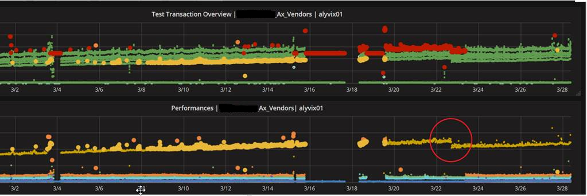
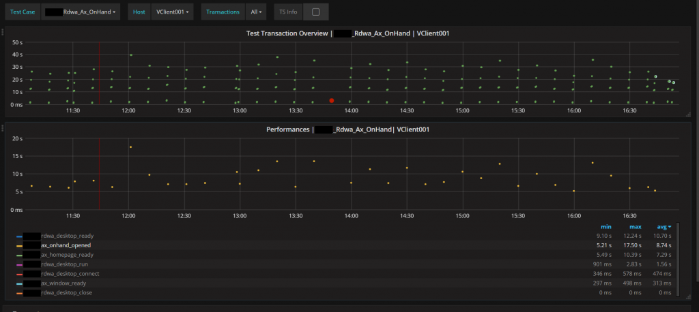

The Alyvix visual monitoring system helps you proactively find problems that would lower the usability of your IT services by monitoring factors such as availability and responsiveness. By tracking the results over time, it can also detect worsening trends that may not otherwise be noticed. Here we describe two real world examples cases illustrating actual problems that occurred and how they were resolved.

===

# Trend-based Performance Monitoring: Exploring Two Real World Cases

Alyvix is a visual monitoring system, typically used to proactively find application slowdowns and breakdowns before users notice and their productivity suffers.

You can also use Alyvix for trend analysis, where test cases are launched at regular intervals and the results are recorded and then graphed in a monitoring system.

Below we'll look at two real world examples from our clients involving Microsoft's Dynamics environment where trend analysis was extremely helpful:

* **Example #1:** Noticing performance degradation over time
* **Example #2:** Adding a missing business-critical test case

## Noticing Slow Performance Degradation Over Time

One customer implemented Alyvix in a MS Dynamics environment, monitoring over RDP. As time went on, we looked at the collected timing data to see if we could find any problems. The first thing that stood out was that the Terminal Server login responsiveness was slowly degrading.

The following screenshot of the monthly trend lets you immediately see the continual increase in response time:

This illustrates the proactive function of Alyvix, especially when integrated in a monitoring system. Why? Because users hadn’t even started complaining. They hadn't even realized there was a problem yet. The decreases in responsiveness were so slow and gradual that they just continually rehabituated themselves. Of course, eventually they would complain, but when? After one more month of reduced productivity?

Thanks to Alyvix, we had a clear and precise overview of the application performance of the company; in fact, we were able to proactively discover the loading time issue and to work to solve it.

By just looking at the raw data from indivudal checks, it would have been impossible to discover this issue until it eventually crossed a warning threshold. But we could clearly see what was happening before users noticed.

### What Happened?

If you look at the screenshot above, you’ll see a red circle representing the time when we made a change to the terminal servers in order to speed them up.

After the change, there was both a significant immediate improvement as well as a lowering of the upward slope. Thanks to dashboards like these, we could begin to work the problem and thus manage it. In fact, half of the difficulty in situations such as these is noticing early that there even is a problem.

After some fixes, zooming in on the performance dashboard shows that the loading times are significantly lower (from 45 seconds to 10, at the green circle).

### Results

The improved results following our change to the terminal servers was thanks to cleaning the Windows registry. Every terminal server has this type of problem, and eventually becomes an issue that affects users enough to cause them to complain about it.

We thus implemented some automated cleaning scripts on the terminal servers to improve future load times, too. In this way, Alyvix also has a preventive role in finding problems and helping system administrators, consultants and programmers know where to look to resolve them before they can affect users.

## Adding a Missing Business-Critical Test Case

ERP systems (e.g., Dynamics) are fundamental for companies: they automate and integrate core business processes, such as taking customer orders, scheduling operations, and keeping inventory records and financial data.

A malfunction in these business applications can result in severe problems across an entire company. Even if they are only slowed down, the ripple effects will still cause employee productivity to drop and costs to increase.

A company once asked us to build some Alyvix test cases in order to proactively monitor their business-critical operations based on Dynamics, specifically the operations they thought were the most relevant to the company’s core processes.

### What Happened?

After a while we got a panicked phone call from the company. There were some serious problems with one of their application transactions, affecting the work of a significant number of employees.

That transaction was related to “on-hand inventory” management, more precisely to the “on-hand inventory” transaction. As they underlined, the issue was extremely relevant, because every single employee was involved in that transaction.

The change in loading time performance was significant, rising from the typical 10 seconds to suddenly requiring 40 seconds. This increase effectively kept employees from working in a timely manner and affected the company’s overall productivity.

### Results

We discovered that a consultant had started a procedure that was too demanding for the company's IT infrastructure, preventing Dynamics from operating correctly. It seemed as if there had been an increase in the number of Dynamics users, and an exponential increase in the number of transactions:

The company thus decided to build another Alyvix test case so they could also monitor this "new" business-critical transaction, which had badly affected the company's productivity.

As you can see, Alyvix can also indirectly monitor Dynamics transaction infrastructure by measuring responsiveness over time of the graphical interface using that transaction infrastructure.

So just by setting up test cases, you can proactively discover anomalies and other issues, helping you avoid slowdowns and the resulting loss of productivity in your business.

## In Conclusion

Alyvix isn't useful just for noticing when a service breaks before your users notice, or measuring response times for your users. You can also pair it with other tools for trend analysis, use it as a debugging tool to make sure new or update applications still work as quickly as before, and keep your business critical applications in line as new functionality is added.

It also shows that Alyvix works just as well with cloud or web-based streaming applications like Dynamics as it does with more traditional local applications.
