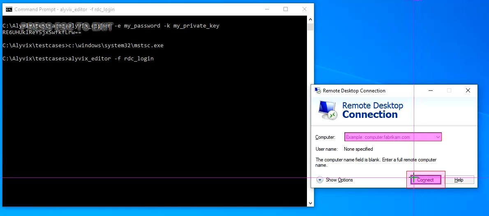
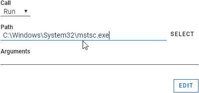
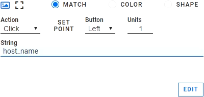
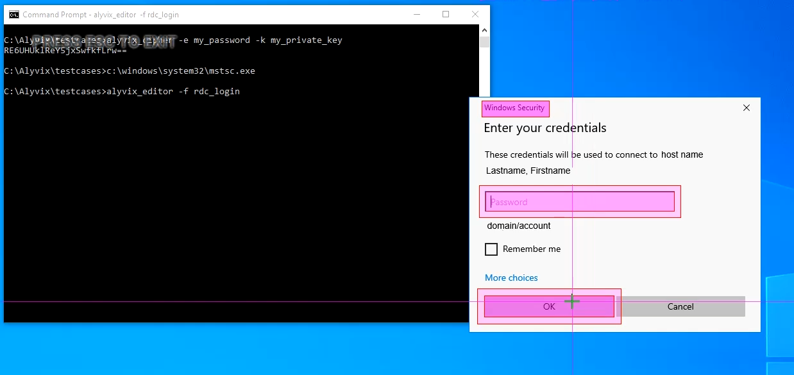
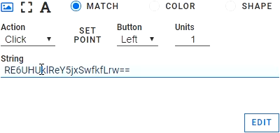

This tutorial shows how to securely log on to Microsoft's Remote Desktop
Connection application in a way that doesn't expose your credentials to public
view. It then gives a complete example of how to use Alyvix Cipher and a
private key to transform credentials into an encrypted string, and then using
Alyvix Robot to automatically decrypt that string when it runs the test case.

===

## Introduction

This tutorial shows how to accomplish a very common task with production systems: Logging in via Remote Desktop Connection. This means you'll need to enter your credentials into RDC's login and password fields.

Suppose you need to run an application remotely, which means you need Alyvix to enter your login and password at the first screen. In this tutorial we'll show you how to do that securely on a Windows machine using Remote Desktop Connection (RDC).

## Alyvix Cipher

Since *.alyvix* files are stored in clear text, directly entering any credentials will leave them open to attack.

You can use the *alyvix_cipher* command together with your password and a private key to generate an encrypted key that is safe to use in the test case. The command format is:

    C:\Alyvix\testcaes\> alyvix_cipher -e my_password -k my_private_key
    RE6UHUklReY5jxSwfkfLrw==

This encrypted key is then saved in an appropriate test case oject in Alyvix Editor. When Alyvix executes the test case, it will decipher the key, and safely enter the decrypted password into the onscreen password field. You only need to ensure that your private key is kept hidden.

## Start RDC

Before we begin, let's start the Remote Desktop Connection (RDC) app so that we can use it in Editor. Run the *mstsc* command from the *Windows\system32* directory:

    C:\Alyvix\testcases> C:\Windows\system32\mstsc.exe

## RDC Host Connection Attempt

Let's start with our Remote Desktop Connection test case by running Alyvix Editor:

    C:\Alyvix\testcases> alyvix_editor -f rdc_login

The first step is to capture the screen with RDC's dialogue panel, so add a few seconds to the delay in Selector and press the ADD button. Now right click on both the Computer field and the Connect button, so that the screen looks like this:.

Next press *Escape* to return to Alyvix Editor. We need to launch RDC immediately on startup, so click on the root node at the right and then go to the Path field at the bottom of the Designer panel.

Now either click on Select and use Explorer to choose RDC, or just directly type the full path as shown in the screenshot below. This will ensure that when our test case starts in either Editor or Robot, RDC will also be started.

To enter the host name into the RDC dialogue panel, we need to set the Click action on the host field so itwill put focus on it, and then enter the string of the actual host name.

We also need to click on the Connect button after the host name is inserted, so change its action to Click. Alyvix will run these actions in the order that the tree components are found in the component tree.

Now we can change the test case object from the default to a name like *StartRDC*, make it a scripting node, and run the script to check that it works.

## RDC Login Enter Password

Next we need to enter our credentials, so let's capture the screen where the RDC dialogue panel asks us to enter our password, as shown here:

Use the left mouse button to select the anchor, then right click to select both the password field and the OK button. In the test case object select the Click action on the password field. Here we would usually enter a password. But we don't want to enter it in clear text. Instead, enter our encrypted key that we created in the section **Alyvix Cipher** above.

When Robot runs the test case with the "-k" parameter set, it will automatically decrypt the password and enter that directly into the password field without ever storing it in the *.alyvix* file.

The last step here is to select the Click action for the okay button, and script this second test case object, as shown here:

## Run Everything from Robot

So let's try running the entire test case from Alyvix Robot. Be sure both scripting nodes are enabled, save the test case, and exit. Now we'll use Robot to run the test case from the command line, adding our private key so Robot can decrypt the password dynamically.

When it runs, Alyvix will start RDC, enter the host name, click Connect, then enter the password, and finally press the OK button. Once the test case is completed, it will display the timing data as in this example:

    C:\Alyvix\testcases> alyvix_robot -f rdc_login -k my_private_key
    2020/04/17 16:36:41.051: rdc_login starts
    2020/04/17 16:36:48.617: StartRDC DETECTED in 4.097s (+/-0.099)
    2020/04/17 16:36:53.168: RDCLogin DETECTED in 0.994s (+/-0.091)
    2020/04/17 16:36:53.350: rdc_login ends OK, it takes 12.298s.

## Summary

This tutorial showed you how to start up a system program given its path, create an encrypted key from your password using a private key, create an Alyvix test case that enters the key in the appropriate field, and run the test case from the command line by using your private key (if you're scripting it, be sure to protect it with permissions or root access).

The content in this tutorial, of course, serves as the first step in a longer test case that will actually do some work within the remote desktop. After you've done those additional steps, don't forget to log out from RDC!
