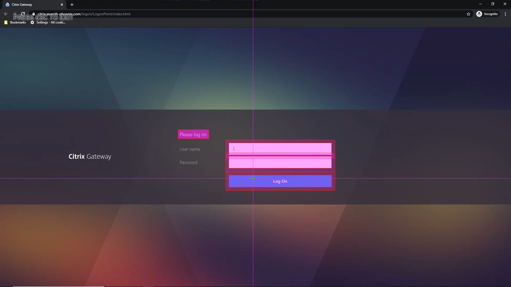
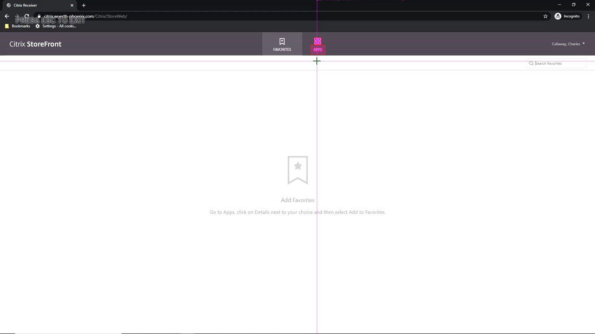
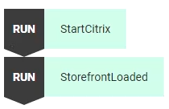

This tutorial shows how to securely log on to a Citrix Gateway in a way that doesn't expose your credentials to public view. It then gives a complete example of how to use Alyvix Cipher and a private key to transform a user name and password into encrypted strings, and then how to use Alyvix Robot to automatically decrypt those strings when it runs the test case.

===

## Introduction

This tutorial shows how to accomplish a very common task with production systems: Logging in via Citrix Gateway.

In general, any time you log in remotely you'll need to enter your credentials into the login and password fields in a web form or the opening screen of an application. Here we'll show you how to do that securely on a Windows server using Citrix Gateway, and then how to use Alyvix Robot to automatically decrypt those strings when it runs the test case.

## Alyvix Cipher

Since *.alyvix* files are an [open standard](https://alyvix.com/learn/test_case_data_format.html#test-case-data-format) and its contents are stored in clear text, directly entering any credentials will leave them open to attack.

You can use the *alyvix_cipher* command together with your credentials and a private key to [generate encrypted keys](https://alyvix.com/learn/test_case_execution.html#alyvix-cipher-for-encryption) that are safe to use in the test case. We'll use the following strings as an example in this blog post:

    C:\Alyvix\testcases> alyvix_cipher -e my_user_name -k my_private_key
    ZGVoB0Fh6E5vd5buiZ/UOw==
    C:\Alyvix\testcases> alyvix_cipher -e my_password -k my_private_key
    RE6UHUklReY5jxSwfkfLrw==

When Alyvix executes the test case, it will decipher any keys, and safely enter the decrypted credentials into the text fields. You only need to ensure that your private key is kept away from others.

It may not be strictly necessary to encrypt the user name, but this example also illustrates that you can encrypt more than one string with a single private key.

## Start Citrix

Before we begin, let's go to the Command Prompt and start up Citrix Gateway in a browser like Chrome, so that we can use it immediately in Alyvix Editor. You'll have to find the correct path on your system.

    C:\Alyvix\testcases> "C:\Program Files (x86)\Google\Chrome\Application\chrome.exe" ^
       https://citrix.wuerth-phoenix.com --incognito --start-maximized

Use the URL for your Citrix Gateway, and add the options *--incognito* and *--start-maximized* as shown so that Chrome will always start up with a clean first page at full screen size. Once it's started up, minimize Chrome to go back to the command prompt.

## Citrix Login Screen

So let's start with our Citrix test case by [running Alyvix Editor](https://alyvix.com/learn/test_case_building.html#test-case-building-editor).

    C:\Alyvix\testcases> alyvix_editor -f citrix_login

We'll need to [capture the screen](https://alyvix.com/learn/test_case_building/selector_interface_overview.html#selector-interface-overview) with Chrome showing the login web page, so add a few seconds to the delay in Selector and press the ADD button.

Next use the left mouse button to select the anchor, and then right click to select the *User name* field, the *Password* field, and the *Log On* button.

Press *Escape* to return to Alyvix Editor.

### Test Case Object Root Options

We need to launch Citrix immediately on startup, so go to the [root node](https://alyvix.com/learn/test_case_building/designer_component_tree.html#structure-of-the-component-tree), and then the [Path field](https://alyvix.com/learn/test_case_building/designer_component_options.html#root-component-options) at the bottom of the Designer panel:

Either click on Select and use Explorer to choose Chrome, or just directly type in the full path. This way, when our test case starts in either Editor or Robot, Chrome will also be started.

You'll then need to also put the URL for your Citrix Gateway into the *Arguments* field. Add the incognito and start maximized options as we did in the command prompt.

### Test Case Object Component Options

To enter the user name in its field in Citrix, [select the first component](https://alyvix.com/learn/test_case_building/designer_interface_overview.html#selections-subselections-and-regions-of-interest), [change its type](https://alyvix.com/learn/test_case_building/designer_component_options.html#rectangle-type-options) to **Rect** and **Box**, and set the **Click** action to put focus on the field.

At this point we would usually enter the user name as a string so Alyvix will type it into that field. But to avoid entering them in clear text where they will be stored that way in the *.alyvix* file, instead, enter the encrypted user name key from before;

When Robot runs the test case with the "K" parameter set, it will automatically decrypt the user name and enter it directly into the field without storing it in the *.alyvix* file.

To enter the password, select the second component, also change its type to **Rect** and **Box**, set the **Click** action, and enter the encrypted password key as we did for the host name.

We also need to click on the *Log On* button, so change the type of the third component to **Rect** and **Button**, then [set its action](https://alyvix.com/learn/test_case_building/designer_component_options.html#common-options) to **Click** as well. Alyvix will run all these actions in the order that the tree components are in.

Now we can give it a name like *StartCitrix*, [make it a scripting node](https://alyvix.com/learn/test_case_building/editor_scripting_panel.html#editor-script-building), and run the script to check that it works.

## Add Storefront Loaded Verification

Let's add another test case object to verify that Citrix loaded successfully. After the prior step, Citrix should have continued to the Storefront page.

To verify that this page has loaded let's create two selections, right clicking on the icon above the word "APPS", and then again on the word "APPS" itself:

Let's *Move* the cursor over the apps icon as a doublecheck for ourselves when it runs. Then rename the new test case object to *StorefrontLoaded* and drag it to the scripting panel.

Now make sure both scripting nodes are enabled, and save the test case so that Robot will have all the information it needs to run by itself.

## Run Everything from Robot

So let's try running the entire test case from [Alyvix Robot](https://alyvix.com/learn/test_case_execution.html#test-case-execution) at the command line, adding our private key so Robot can decrypt our credential keys that are now stored in the *.alyvix* file.

    C:\Alyvix\testcases> alyvix_robot -f citrix_login -k my_private_key

When it runs, it will start Chrome at our URL, enter the user name and password, click the *Log On* button, and then check that the Storefront page has correctly loaded.

When it's done, Robot displays the click-to-appearance [timing results](https://alyvix.com/learn/test_case_execution.html#cli-output-format) in the Command Prompt. Here it took 2 seconds to load the Storefront page after logging in:

    C:\Alyvix\testcases> alyvix_robot -f citrix_login -k my_private_key
    2020/04/28 16:29:40.316: citrix_login starts
    2020/04/28 16:29:54.864: StartCitrix DETECTED in 9.7s (+/-0.077)
    2020/04/28 16:29:58.193: StorefrontLoaded DETECTED in 2.056s (+/-0.081)
    2020/04/28 16:29:58.276: citrix_login ends OK, it takes 17.959s.

## Summary

This tutorial showed you how to start up a browser given its path, create two encrypted keys to hide both our user name and our password, make Alyvix log in to a Citrix Gateway with those encrypted keys, and run the test case from the command line by using your private key (if you're scripting it, be sure to protect it with permissions or root access).

The content in this tutorial, of course, serves as the first step in a longer test case that will actually do some work within the remote desktop. After you've done those additional steps, don't forget to make your test case log out from Citrix!

<iframe width="288" height="162" src="https://www.youtube.com/embed/KNfB_pVijX4?color=white&rel=0" frameborder="0" allow="accelerometer; autoplay; encrypted-media; gyroscope; picture-in-picture" allowfullscreen></iframe>
