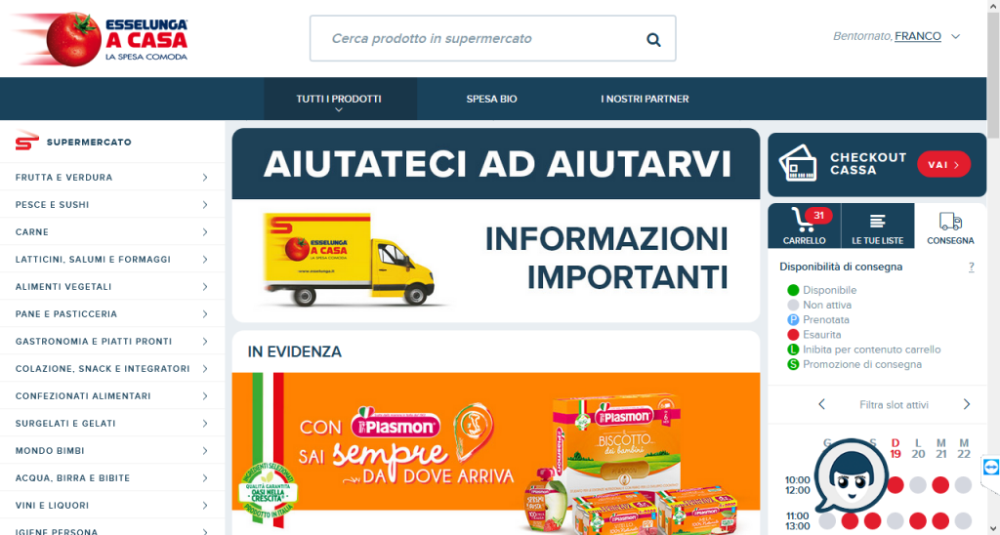
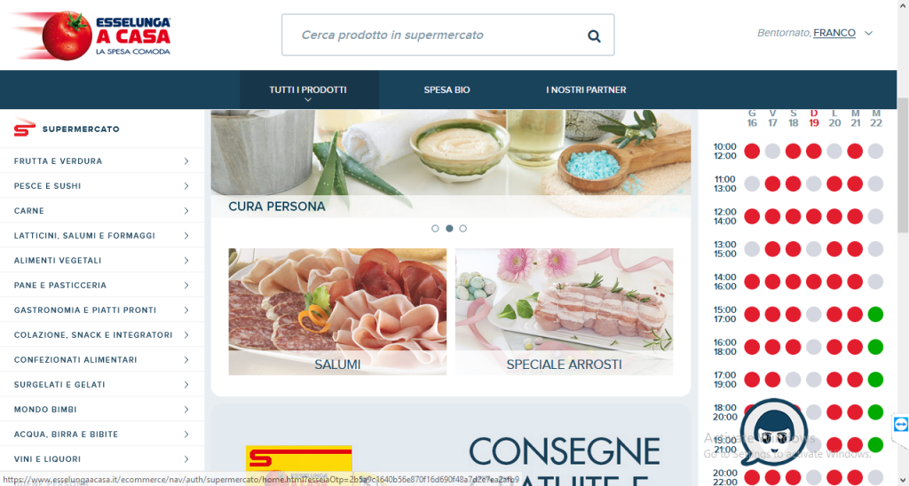

The Covid-19 epidemic had significant effects on Italians during the national lockdown this spring. It also resulted in significant, unpredictable effects on e-commerce throughout Italy, especially in terms of the physical delivery of packages. When web sites added slot-based reservation mechanisms to their ordering process to keep demand at sustainable levels, it turned out that Alyvix could be a big help.

===

## "Navigating" a Pandemic

When the COVID-19 pandemic first arrived in Italy, weeks before arriving in many other countries, there wasn't a plan on how to handle an unpredicted surge in e-commerce. We couldn't turn to Germany or France to see what steps they had taken.

After all, a casually communicable, widespread pandemic hadn't been seen in Europe in a century, well before the Internet existed. But when the Coronavirus did arrive, the government's response was to lock down physical movement as much as possible.

Suddenly, going to the grocery store was much more difficult, to say nothing of other kinds of shopping. And even grocery shopping with masks, gloves and disinfectant was risky for significantly at-risk populations like the elderly, who also tend not to be tech literate.

### Everybody Goes Online

The answer for many people was to turn to online shopping, where a delivery driver could ring the doorbell, leave the package, and run. After all, just about everyone is at home all day long anyway.

But the problem now was that just about everyone wanted to order online, at the same time. And it's not like people are computer systems who will distribute their ordering requests and will happily wait for deliveries even from midnight to 7AM. Typical patterns were just reinforced, and so there needed to be rationing.

Rather than a scarcity of goods, there was a scarcity of supply chain infrastructure. Could ordering systems keep up? Could logistics keep up? Everything needed to be put under limitations, streamlined and prioritized.

### Handling the Demand Surge

Online shopping sites did just that, limiting the number of items that could be bought per week, slowing down the delivery of low priority items, reducing the number of overall orders that could be placed in a particular time period, and limiting (especially perishable) orders if there were not enough delivery slots available.

A lot of these "solutions" just move the problems from the e-commerce site to the consumer. For the web site, only the restriction mechanism needs to be added and update, but every other part of their operations remain the same.

At the height of the lockdown, an e-consumer might have had to spend a lot of time trying to find an available slot, since everyone else was looking for them too. Especially in the case of perishable items like groceries, finding a physical delivery slot is the most important.

### Alyvix to the Rescue

You had to manually check each web site multiple hours a day, because the time slot display would typically appear graphically rather than in a common computer-readable format like XML, since consumers are people.

Why not use Alyvix to do the checking for you? It excels at finding information on human-readable web sites, and notifying you when a particular outcome is visible. In the worst case you could check whenever you wanted with a simple Up-Arrow and Enter from the command line, while Alyvix does all the work of navigating and looking for a free slot.

Often there are no available slots, but you don't know when the web site will be next updated to show free slots, so the better option is to regularly schedule Alyvix to do it for you, say every 5 minutes. How about with an automatic notification to your monitoring system, email or favorite direct message service?

### Example: Grocery Shopping at Esselunga

Our colleague Franco Federico decided to use Alyvix to find a delivery slot at the Esselunga grocery store. Whether any slots are available that day is visible on the main page:

But that's only half the story. You can't just check if you can see a green circle, because you'll see one right away in the legend, regardless of whether slots are available. Plus, you need to scroll down the page to see all of the time slots.

So Franco built a full Alyvix test case to monitor Esselunga's web site, checking for an available slot every 5 minutes. Because Alyvix is so simple to use, it only took him minutes to create the test case and set it to alert him as soon as a free slot appeared.

When Alyvix detected green slots finally appeared, he knew he could order his groceries:

### Conclusion

Although this is a perfect example of use for consumers, you shouldn't think that that's a limitation. The logic is also useful for many situations in business-to-business e-commerce, where a lot more money can be riding on the outcome. In addition, you probably already have a monitoring system that you can quickly integrate Alyvix into, taking advantage of your existing configurations for notifications and history, allowing you to also look at trends over time.

Alyvix really can be a valuable tool for your business. Don't wait until the next pandemic to find out why.
