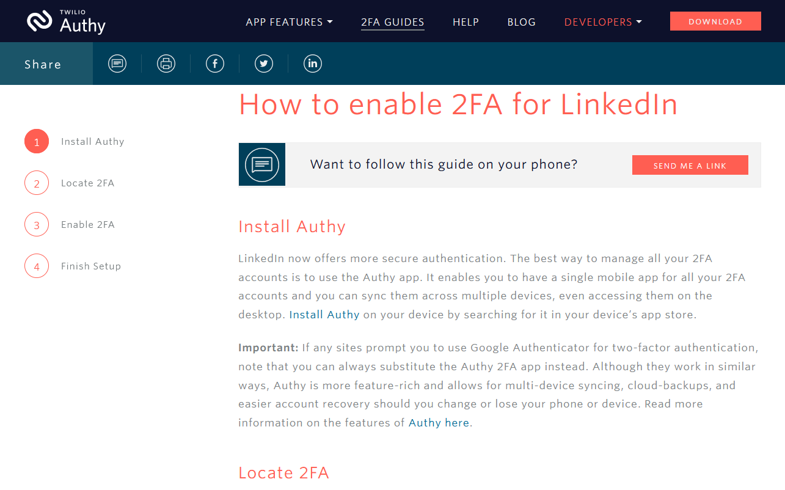
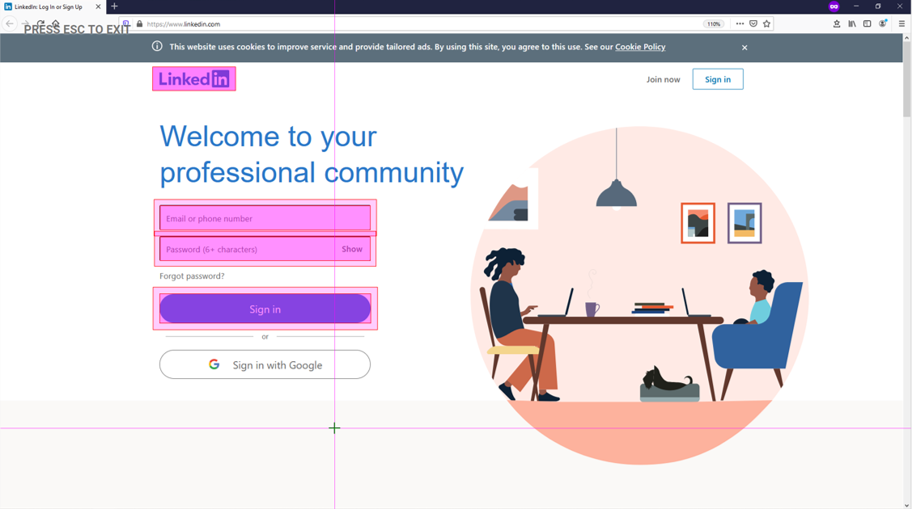

You always monitor the systems and services you provide, especially your user-facing services. So why should your multi-factor authentication processes be any different? Use visual monitoring with Alyvix to regularly check that your MFA login procedure is running smoothly. We'll show you how to build a test case that logs you in to LinkedIn via 2FA, and logs you back out again. Feel free to modify it for your needs.


===


## Multi-factor Authentication and Visual Monitoring

Multi-factor authentication (MFA) increases security by requiring information that's unknown to the user, so that it cannot be copied like usernames and passwords can. The easiest method is a form of 2-factor authentication, consisting of the standard password plus a one-time code sent via SMS or smartphone app.

In essence, the authentication process running on your system that allows user access runs just as all the other services your systems perform. It can go down, and it needs to be monitored. You can go the application performance management route, but don't think for a second that you can't do this with visual monitoring. After all, if your users can do an interface task, so can Alyvix.

This article will show you how to build an Alyvix test case that checks on a 2-factor authentication service by reading an authentication code from a third party app, and inserting it into an online login page.

In particular, you'll see how to make Alyvix log in to [LinkedIn](https://www.linkedin.com) using a Time-based, One-time Password (TOTP). Armed with that knowledge, you'll then be able to use Alyvix to check the responsivity of your own authentication services just as you would for any other service. Check out the [video version](https://youtu.be/RdvamQAG3oI) of this tutorial to see specific steps and best practices when creating your Alyvix test case.


### Prerequisites

To follow along with this multifactor LinkedIn login example, you'll need an active LinkedIn account. If you want to run checks on your own services, you'll need to adapt this approach and use those credentials and the necessary configuration steps instead.

You'll also need an installed and configured multiplatform authenticator. We've used Authy for this example as it has a Windows version. With additional effort you could instead install a smartphone app via the [Android Studio emulator](https://developer.android.com/studio/run/emulator) on Windows.

For now though, we'll continue assuming you're using LinkedIn and Authy.


### Install and Configure Authy and LinkedIn

First, [download and install Authy](https://authy.com/download/).

When you first set it up, you'll need a phone number and an email address. You'll receive a verification request via SMS. Next, add an account representing LinkedIn. Authy will wait for you to enter the coordination code that we'll get soon.

In fact, Authy maintains [a number of guides](https://authy.com/guides/) for configuring popular web sites and apps, and obtaining the coordination code that enables time synchronization between those sites and Authy.




### Configuring LinkedIn for 2FA Access

On the LinkedIn web page, go to the Settings and Privacy screen, look under the Account tab, click on the "Two-step verification" option, and turn it on.


Select "Authenticator App", type in your LinkedIn password to verify the change, and then copy the secret code. In the next step, you'll give this code to Authy, and then paste the 6-digit code Authy gives you back in this box in LinkedIn.


Returning to Authy, paste the code from LinkedIn to add the account, select a color or logo, and press the "Save" button. Once Authy has synchronized with the Time-based One-Time Password, it will begin to display its own code that you can paste in LinkedIn to complete the setup.


### Preparing the Test Case

Regardless of whether you use Firefox, Chrome or any other browser when running your test case, you'll want to put the browser into full-screen, private mode so that interface elements are always in the same relative positions and sizes, and so browser cookies and saved logins won't negatively affect test flow.

```
> C:\Program Files\Mozilla Firefox\firefox.exe -private-window https://www.linkedin.com/
```

If you'd prefer to use Chrome, you can also check out our blog posts on [Citrix Login](https://alyvix.com/blog/20200506_citrix_login) and [RDC Login](https://alyvix.com/blog/20200505_rdc_login), both of which use Chrome.

As in those two examples, you'll also want to encrypt any credentials you'll be using, so create a private key for each (and don't share it with anyone, or an attacker will be able to recover your actual password given that key and the encrypted key). For this we'll use [Alyvix Cipher](https://alyvix.com/learn/test_case_execution.html#alyvix-cipher-for-encryption):

```
> alyvix_cipher -e <website_password> -k <your_private_key>
MUb1Ma4zxDoKPpZHRmUXxw==
```

Now we're ready to launch Alyvix Editor and get started:

```
> alyvix_editor -f linkedin_mfa
```


### Building the Test Case

Start by pressing the "Add" button. When the login page is visible, set the LinkedIn logo to be the anchor and right click on the login field, the password field, and the "Sign In" button to show Alyvix where to enter our credentials.



To start the browser automatically whenever the full test case is run, go to the root node, insert the browser's path, and add the arguments including the URL:


Next, associate the interface boxes we indicated just above with the appropriate set of credentials, by typing those credentials into the separate String fields. Since we'll be testing right now, go ahead and insert the real password, but we'll have to remember to change it to the encrypted password later so that Alyvix Robot can run the test case without having the credentials in cleartext.

The last step here is to assign a Click action on the "Sign In" button. Your component tree should now look like the following:


Give this step a name (we'll call it "EnterCredentials") and keep the Measure field set in Alyvix Selector, since this is a user-facing page and we want to know how long it took to load (especially if it's our server rather than LinkedIn's).

You can now add this test case object to the scripting panel with the "plus" icon to the left of the name, and then test it by pressing the "play" icon. Alyvix will enter the credentials in the web page and then press the "Sign In" button, which the website will respond to by asking you to enter the 2FA authentication code.


### Launching Authy and Finding the 2FA Code

We now have a field where we can enter the 2FA code, so it's time to go get it, which means it's time to start up Authy.


We'll build a simple test case that recognizes the text saying the code is expected, and then use its root node to launch Authy given its path, just like we launched Firefox above (this time no arguments are needed). Let's call it "LaunchAuthy", and we can unset the Measure box unless we really need to know how long it took to respond to the login request.

After launch, Authy shows our LinkedIn entry that we configured above. Our next test case object needs to find that entry (there might be more than one), so we create a second group (the green highlight) to look for the icon and text caption:


When we find it, all we have to do is click on it. Let's call this one "SelectAuthyLinkedIn" and unset the Measure box, as we don't really need to check response time for a native Windows program on the same computer.


Finally we're ready to copy the 6-digit 2FA code and give it to LinkedIn. There's a hitch, though, as Authy puts a space in the middle. So given the screen above, we would get "769 161" instead of "769161", which will cause LinkedIn to reject it.

The simplest solution is to scrape the two sets of digits as two separate test case objects. So we'll create two test case objects both of which use a text component and regular expression to capture the digits.


Here's a great opportunity to use the new Duplicate action found in Alyvix version 3.1.0, since the only difference between the two is the position of text component (the first 3 digits versus the second 3 digits).

We're now ready to enter the full Time-based One-Time Password into the box on the LinkedIn web page. As usual you set the anchor, select the text box where we should enter the code, and indicate the Submit button so that after entering the code we can log in.

We need to copy the two sets of digits that we scraped during the last two steps and enter them into the String field using the following data extraction notation you see on screen.

```
{GetTOTP1.extract}{GetTOTP2.extract}
```

The curly braces indicate to Alyvix that the content must be processed and then converted to a string. The `extract` keyword says to retrieve the value stored by a previous test case object, in this case from the two we just created to read the two sets of digits. Since they are placed right next to each other in the String field, both sets of digits will be inserted into the field in the web page.

Once pasted in, we also need to click on the "Submit" button so that LinkedIn actually receives the time-based code.

Since we're done with Authy, we can also kill the program right away via the root node. Killing programs after they are not needed anymore is best practice because typically test cases will run over and over on the same machine, and you don't want to consume too many resources or have multiple instances running.

Let's name this step "EnterTOTP" and add it to the scripting panel. Now we'd like to run it, but if we do we'll retrieve sets of digits recorded at different times. What we want to do is get the two sets of digits at the same moment.


So let's take advantage of another new feature in Alyvix 3.1: Multi-select these last three steps as shown here and then click on the "Run Selection" button. This will run only those three steps, which will together scrape the 6-digit code, paste it into the field, and click "Submit".


### Cleaning Up

We should be logged in now, but there are several tasks left to do:
* Check that we really did successfully log in
* Log out (best practice is to leave everything as when we started)
* Cleaning up resources if there's a failure
* Setting up the test case to run repeatedly with Alyvix Robot

Checking for success is pretty easy: we can just look if screen elements that are only visible when a successful login occurred are there, such as LinkedIn's toolbar. Make sure the Measure option is set because we'll want to know how long a successful login took after entering the code.

Logging out is also pretty easy: you can either use LinkedIn's traditional two-click logout procedure, or to save time you can enter their logout endpoint directly into the browser's URL field.

Since monitoring authentication procedures is mainly useful for production systems, we need to worry about what happens when things go wrong, which would leave resources tied up that would block later check attempts. Best practice in this case is to create Fail and Exit sections.

A Fail section is executed immediately after any scripting node fails as a way to ensure a graceful exit. An Exit section is always executed whenever the main script completes normally.

To create a scripting node for either a Fail or Exit section that only disposes of resources, we simply add a new test case object and immediately press the Escape key so that the component tree consists only of a root node. This will always match any interface, and will thus always be executed.

For this example we create Fail nodes to kill both Authy and the browser if they're running. In the successful case, Authy will have already been killed by the main script, so the Exit script only kills the browser by clicking on its window close icon.

Finally, I hope you haven't forgotten that we used our real password back in the first step since we were testing repeatedly. We don't want that saved in cleartext in the final .alyvix file, so we go back to the "EnterCredentials" step and replace the password with the cipher we created.


(You can see our other videos on RDC and Citrix for more detailed descriptions of how to use Alyvix Cipher.)

We can then run Alyvix Robot with the private key, and the password will automatically be decrypted when needed:

```
> alyvix_robot -f linkedin_mfa -k <your_private_key>
```


### Conclusion

Just like your other services, you need to monitor your multi-factor login procedure to ensure users always have problem-free access to the information and activities they need. We've just seen how Alyvix can check on a 2FA login process for LinkedIn. But the sky's the limit, you can modify this test case to suit your own circumstances.

<iframe width="288" height="162" src="https://www.youtube.com/embed/RdvamQAG3oI?color=white&rel=0" frameborder="0" allow="accelerometer; autoplay; encrypted-media; gyroscope; picture-in-picture" allowfullscreen></iframe>
