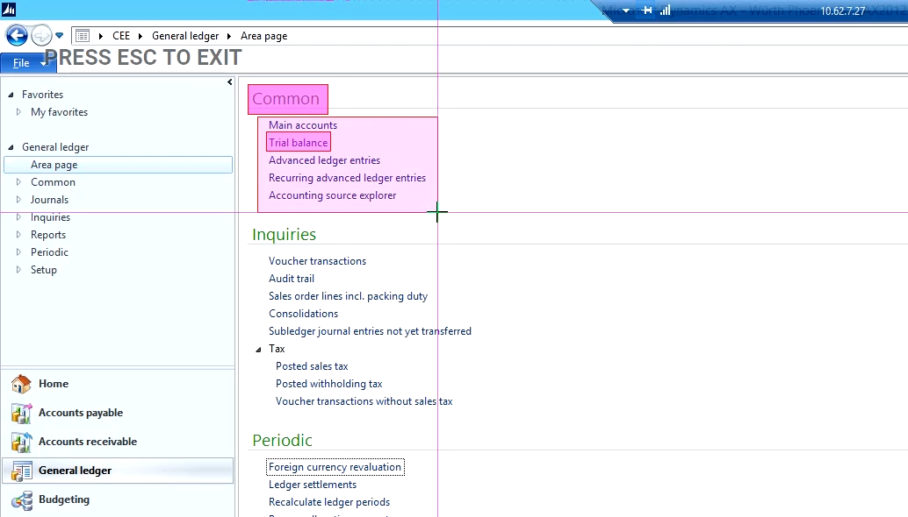
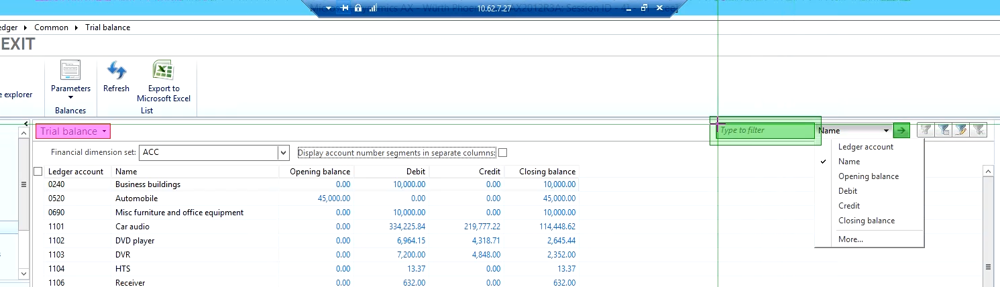
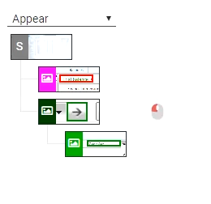
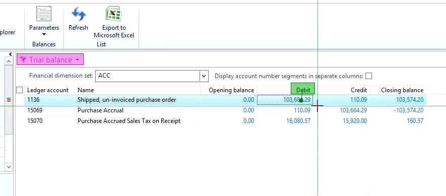

Microsoft Dynamics AX 2012 plays an important role in the business activities of many companies.  As a user-centered application, its performance from a user perspective is vital because of the many and wide-ranging types of employees who can't get their jobs down when it's not available and responsive.

We show how to build a test case to inspect and measure two common tasks within AX, filtering and detail inquiry, inside AX's Business Ledger.  A related video in our YouTube channel gives detailed, step-by-step instructions on how to construct the test case described here.

===

## Microsoft Dynamics AX Monitoring - General Ledger

Due to the importance of Microsoft's Dynamics AX to business activities and its widespread use, monitoring installations of Dynamics AX 2012 from a user perspective is vital to guaranteeing continuity in the many business services it provides. In this article we'll look at how you can use Alyvix to build a complete test case to visually monitor Dynamics AX, looking in particular at filtering in the General Ledger section, and the proper use of groups in Alyvix to allow flexibility in the event that windows and tables are resized.

In particular, we will show Alyvix how to navigate through the General Ledger to view record details after setting a filter to find a specific purchase. We'll also describe best practices for dealing with repositionable elements like window controls and tables. Finally, our test case cleans up after itself by closing all the windows it opened and leaving AX in the same state as when it started.

We'll measure the key individual steps of our test case so that we can ensure that system responses aren't taking too long. Because Alyvix sees a system interface just like humans do, when Alyvix notices slow performance it means that real users are also seeing slow performance. Alyvix delivers the measured transaction times at each desired point when the test case run completes, allowing you to automatically check when the responses exceed a threshold that you choose.

### Step #1: Launch AX from the RDC Desktop

To start, we need to launch AX, so our first step is to tell Editor where to find the AX desktop shortcut on the screen, and then to launch it by telling Alyvix to double click on the shortcut. Next, we need to make sure that the AX interface is maximized to full screen size before we start using it, since the relative positioning of interface elements affects whether or not Alyvix can match them.

Best practice for maximizing a window is to create two test case objects, one that checks whether the window is already maximized, and another that maximizes the window if it's not. In the script the two are then joined with the *IF FALSE* expression.

### The General Ledger Task

For our General Ledger test case we'll first need to navigate to the right section, so we create a test case object showing Alyvix how to write the path to the General Ledger section directly into the address bar. Creating test case objects follows a typical pattern: create a screen grab of the interface, identify important areas on the screen, add any mouse and keyboard input to interact with those areas, give it a name, show it how to measure the results, and finally, give it a quick test run to make sure it works.

For this navigation subtask, we use two icons to guide us to the address field, show Alyvix where the insertion point should be, and tell Alyvix the navigation string to insert:

  CEE/General ledger/Area page{Enter}

The "{Enter}" part of the string tells Alyvix to press the *Enter* key after it has entered the first part of the string, causing Dynamics AX to begin navigating with that string. We could also have clicked on the address button, but this saves us a bit of time.

Once done, we give the test case object a name, set the monitoring parameters such as the timeout value, add it to the script, and then press the "run" button to immediately test it.

This takes us to the General Ledger index page. In this example we want to go to the *Trial Balance* section, so we show Alyvix how to find it, and then it's just a matter of clicking on it.

Now that we've arrived at the right place, we can select the data to display. An important technique when using AX is to filter query results to more easily find what you're looking for. Here we show Alyvix where the filter box is and how to select the Name field as the basis for filtering. A first test case object opens the filter dropdown, and a second enters the filter text and starts filtering.

### Using Alyvix Groups

You'll notice in that screenshot that some of the selections are red are some are green. These colors correspond to the two groups of components in the component tree:

A single group could have been used here to cover all of the components. But since it's possible that the window size will change in the future, the window controls in the second (green) group may "float" to the left or right. By putting the areas that will remain on the left in a separate group from those on the right, whether they match or not is no longer predicated on the relative distance and orientation between them. You can thus make modifications later or change the screen resolution without having to completely redo your component tree.

The results are returned as a table, and Alyvix can then pick one of the table rows and drill down into the details. Here again there's a potential problem with the positioning of the components: the table columns can also have their widths changed by users, or the order of the columns can be changed, and thus again we need to separate them into groups:

### The Exit and Fail Scripts

Once we have the details window, we can begin drilling down to check that the actions work correctly and return the proper results. Our test case drills down with three steps, opening up two windows in the process. One of those windows we can close with the last test case object we created. But after opening a series of windows, we're bound to leave a few open. That's exactly one of the things our Exit script is intended to do for us.

Whenever one of your test case finishes, it's important to clean up any resources we used (e.g., windows left open, log out after logging in, or changing application parameters). After all, we'll want Alyvix Robot to carry out the end goal of visual monitoring by running the same test case every few minutes. If previous windows are still open and hiding the first elements our script looks for, our test case objects won't match.

The Exit script runs automatically when the main script concludes, whether the script finishes successfully or not. In our case we need to close one leftover window and then close the Dynamics AX application. So our Exit script here only needs to close two windows.

The Fail script instead is run immediately before the Exit script whenever a test case object did not match. Here the only problems that can occur after a failure happens is that some windows are still opened, so our Fail script closes any opened AX windows before continuing on to execute the Exit script. Neither the Fail nor the Exit script should contain test case objects that will break, or that need to be measured.

### Conclusion

In this article we created a full Alyvix test case that monitors the General Ledger application within Microsoft Dynamics AX, including creating groups to properly manage resizable windows and tables. When we run the test case in Alyvix Robot, the timing results are displayed for the steps we requested.

<iframe width="288" height="162" src="https://www.youtube.com/embed/cW87feKJbAU?color=white&rel=0" frameborder="0" allow="accelerometer; autoplay; encrypted-media; gyroscope; picture-in-picture" allowfullscreen></iframe>
