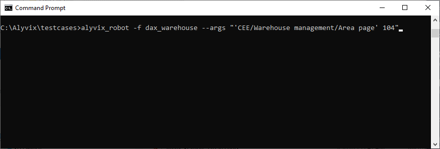
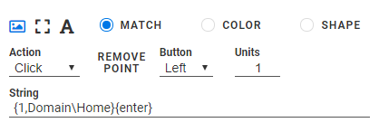
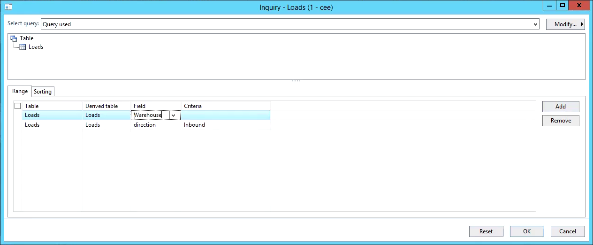

Microsoft Dynamics AX 2012 is important for utilizing business services used by many companies, even for managing typically satellite operations like warehouse management. As a user-centered set of applications, the performance of all AX modules from a user perspective is vital because of the wide array of employees whose jobs are impaired when it's not available and responsive.

In this blog post we show how to build a test case for Microsoft Dynamics AX that checks performance in the Warehouse Management module by building and using an advanced filter that retrieves values from the command line as part of its filter conditions. A related video in the Alyvix YouTube channel gives detailed, step-by-step instructions on how to construct the test case described here.

===

## Microsoft Dynamics AX Monitoring - Warehouse Management

Monitoring installations of Dynamics AX 2012 from a user perspective is vital to guaranteeing continuity in the many business services it provides. In this article we'll look at how you can use Alyvix to build a complete test case to visually monitor Dynamics AX, in particular for constructing an advanced filter in the Warehouse Management module, filling in values for the filter conditions by retrieving them from the command line interface arguments, and then drilling down on details from a record listed in the filtered results.

Along the way we'll measure the key steps of our test case to ensure that system response time is within expectations. Because Alyvix sees system interfaces in the same way humans do, when Alyvix detects performance delays it means that real users are also seeing delays. Alyvix reports the measured transaction times at each point selected in our test case when it completes its run, allowing you to automatically check when the responses exceed your chosen threshold limit.

### Command Line Arguments and Alyvix Robot

When we launch Alyvix after constructing our test case, let's try passing it some command line arguments, one specifying the global path to the Warehouse Management module, and a second specifying a particular search filter value:

> C:\> alyvix_robot -f dax_warehouse --args "'CEE/Warehouse management/Area page' 104"

You can pass one or more arguments using the **--args** parameter, adding quotation marks when there are more than one argument. All arguments are treated as strings, so if you want to include a space in an argument as in our example above, you'll need to use single quotes in the Python style to mark the boundaries of each individual argument.

### Launching AX from the RDC Desktop

Assuming we've already logged in to a Windows Server via RDC, the first step in building our test case is to launch AX, so we need to show Alyvix Editor how to find the AX desktop shortcut on the screen and then double click on it to launch it. Don't forget, we need to maximize the AX window before we start using it, since the position of interface elements relative to the others affects how Alyvix is able to match them (we've already covered this topic [in a previous AX article](https://www.alyvix.com/blog/20200917_dynamics_ax)).

### The Warehouse Management Task

For our Warehouse Management test case we'll first need to navigate to the correct section. One way to do this is to write the path into Dynamics AX's address bar. In our example we can retrieve the address from the command line arguments. So once we build the step that tells Alyvix where the address bar is, we can instruct Alyvix to click on it and then insert the notation **{1}** into the component's string field.

When Alyvix Robot runs the test case, it will extract the first argument and insert the argument in place of the **{1}** in the string. You can also add a default value by inserting a comma and a value after the number. Later on we'll also see how to extract the second argument using the notation **{2}**: in fact, you can reference the *nth* CLI argument using **{n}**. In this example, the first argument will be inserted into the Address bar, and if no arguments were supplied to Alyvix Robot, it will enter the default value "Domain\\Home":

When we run just this step, Dynamics AX takes us to the Warehouse Management index page. There we show Alyvix where to click to take us to the *Active Load* section.

### Using Advanced Filters

We now see a large table, but let's create an advanced filter using multiple search criteria to reduce the table size. We'll overwrite the existing first search condition by finding the *Field* column and inserting the following string into the component's string field:

> {ctrl down}{shift down}{right}{right}{shift up}{ctrl up}Direction{tab}Inbound

Why is it so complicated? In most applications you can select all the text in a text field by using Control-A:

> {ctrl down}a{ctrl up}

Unfortunately that's a reserved shortcut in Dynamics AX. Once we've selected the text in the field, we can overwrite it with the *Direction* key, tab to the field to its right, and then insert the value *Inbound*. By itself, this will already filter the table. But let's add another filter condition while we're at it.

We show Alyvix how to click on the "Add" button, then we find the *Field* column again, insert the *Warehouse* key, tab to the right, and enter the code for the warehouse. As with the Address bar above, we could enter the value directly. But we can also get the warehouse code from the command line. Since we've already used a first argument, this will grab the second argument:

> Warehouse{tab}{2,104}{enter}

Here we've entered a default key of *104*. If the command line contains a second argument, Alyvix Robot will use it in the filter condition, otherwise we will default to warehouse \#104. Finally, the *{enter}* keyword saves us from having to press the "OK" button; it activates the filter all by itself.

### Drilling Down, Checking, and Exiting

The results of the filter are returned as a table, just smaller than before. Now Alyvix can pick one of the table rows and drill down into the details for that record. Because tables can be resized and their columns reordered or their widths changed, you should always use groups when interacting with them, as described [in our Microsoft Dynamics AX General Ledger article](https://www.alyvix.com/blog/20201021_dynamics_ax_ledger).

We can continue to drill down to check that the actions work correctly and return the proper results. Our test case drills down with three steps, opening up two windows in the process. One of those windows we can close with the last test case object we created. But after opening up multiple windows, we're bound to leave at least one open, and closing them is exactly one of the things our Exit script is intended to do for us.

Whenever one of your test case finishes, it's important to clean up any resources we used (not just windows left open, but logging out after logging in, changing application parameters, etc.) After all, Alyvix Robot is intended to perform visual monitoring by running the same test case every few minutes. If previous windows are still open, they may hide the first elements our script looks for, our test case objects will no longer match, and we will see failed results that have nothing to do with whether the application is still working.

The Exit script runs automatically when the main script concludes, whether the script finishes successfully or not. In our case we need to close one leftover window and then close the Dynamics AX application. So our Exit script here only needs to close two windows.

The Fail script instead is run immediately before the Exit script whenever a test case object did not match. Since we assumed we were already logged in via RDC, the only failure that can really occur is that some windows are still opened, so our Fail script closes any opened AX windows before continuing on to execute the Exit script. Note that neither the Fail nor the Exit script should contain test case objects that will break, or that need to be measured.

### Conclusion

In this article we created a full Alyvix test case that monitors the Warehouse Management module within Microsoft Dynamics AX 2012, including creating an advanced filter and retrieving arguments from the command line. We also described best practices that will help you improve your own Alyvix test cases.

<iframe width="288" height="162" src="https://www.youtube.com/embed/vGNgr7LJkm0?color=white&rel=0" frameborder="0" allow="accelerometer; autoplay; encrypted-media; gyroscope; picture-in-picture" allowfullscreen></iframe>
