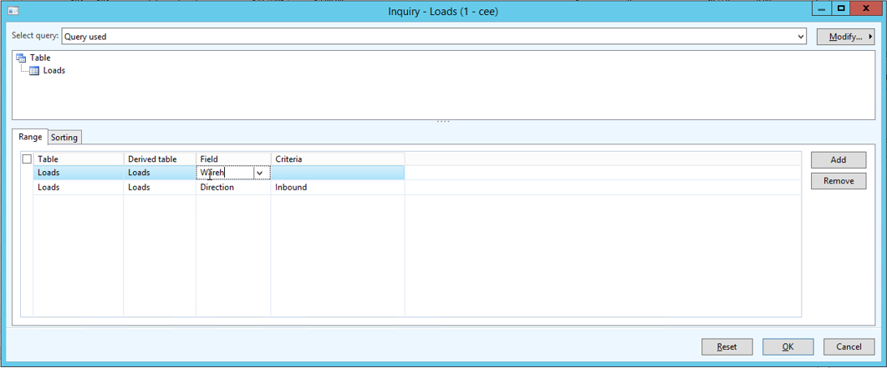
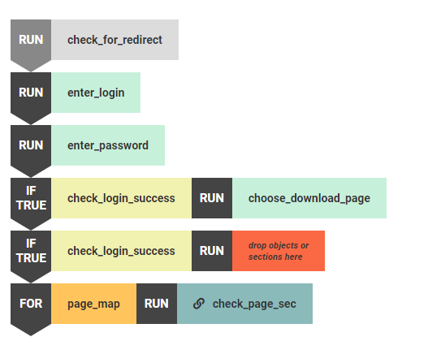
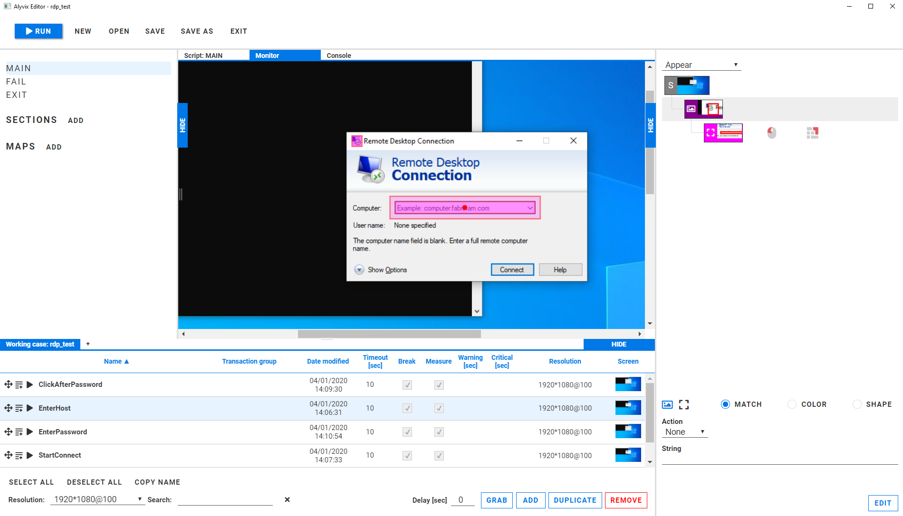

Automation means a lot of things to a lot of people.  At the application level, the two most important uses of automation are for getting more work done, and for checking that applications are available and working properly 24 hours a day, seven days a week.  Robotic Process Automation (RPA) focuses on this first task, while the visual monitoring solution embodied in Alyvix is suited for the second.  In this blog post we'll take a look at RPA, and see how it compares to visual monitoring.

===

## Exploring Robotic Process Automation

[Alyvix](https://alyvix.com/) is a visual monitoring solution that lets you monitor your applications using their own GUI directly.   But it's not the only type of automation tool that interacts visually with applications to improve or augment client productivity or experience.

Automation is, of course, a powerful way to increase your existing capabilities that is only gaining in importance as the number of computing devices increases.  Research/advisory companies like Gartner [predict](https://www.gartner.com/smarterwithgartner/gartner-top-10-strategic-technology-trends-for-2020/) that the increasing (and increasingly complex) use of automation, such as Robotic Process Automation, will be one of the defining trends of 2020.

By [robotic process automation](https://en.wikipedia.org/wiki/Robotic_process_automation) (RPA), we mean an autonomous *software bot* that can take methodical, repetitive [business process tasks](https://www.redhat.com/en/topics/automation/what-is-robotic-process-automation) typically carried out by people, and perform them continuously without needing human input.  These tools work by using the same application GUI that users have access to, repeating those users' specific application workflows like entering text into forms and  pressing buttons.

The business pitch for using RPA software is that it will achieve significant savings due to reduced personnel costs, since computers can more cheaply do tedious tasks, while at the same time freeing up employees to do more useful and interesting work, or even reallocating the resources that are saved to support ongoing business strategies or initiate new ones.

## Robotic Process Automation and Visual Monitoring

Like visual monitoring, the [RPA](https://www.aiim.org/What-is-Robotic-Process-Automation) approach to automation works by interacting with the application's existing GUI rather than interfacing with the application's code via an API.  Its purpose is typically to speed up the pervasive, time-intensive work already performed by employees as a large part of their existing daily task set like data entry and order management.

Monitoring on the other hand is a task that people perform irregularly or not at all in many organizations until a slow or broken application leads to significant problems for the business.  Put another way, very few people are employed to click on a browser's reload button all day in order to check that a website is responsive at all times.  While it was cheaper to ignore the problem in the past, the advantages of automation now means it costs even less to actually address it.

Both approaches utilize the GUI directly.  RPA methods typically record sequences of human-driven actions while performing a task (such as memorizing the exact <X,Y> points of a series of mouse clicks) as though it were recording a macro via the OS's GUI rather than the application itself.

For approaches that are not application-external like RPA and visual monitoring, the progressive scale of complexity for application automation looks like this:
* [Macros](https://en.wikipedia.org/wiki/Macro_(computer_science)#Application_macros_and_scripting), which use the application's own action/event stream
* Scripting, which extends macros by adding a short interpreted language, basic logic, and application-internal objects as datatypes
* API functionality, usually written in the same programming language as the original and compiled along with it, as with [Selenium for web testing](https://www.selenium.dev/documentation/en/)

Alyvix's approach to visual monitoring involves annotating screen grabs of the GUI and letting scriptable logic determine how to interpret the changes in the interface it's interacting with, allowing it to recognize whether each individual step has been correctly carried out or not, and how long it took to do so.  For instance, Alyvix has an explicit drag-and-drop scripting interface that implements logic:

Because both approaches route automated interactions through the standard GUI rather than via an API, they are not tied to a single application.  And since they have their own user-centric overlay environment, new cases and new interaction steps can also be created by any person, not just by programmers.  This leads to more transparent and verifiable automation cases without the worry of introducing bugs each time the code is changed, or having to maintain that code in the future.  Neither approach changes the underlying application in any way, merely running in parallel with it.

## Automation and Its Advantages

Automation is one of those words that can mean different things to different people.  DevOps automate configurations in their networking and VM infrastructure, middleware software developers automate their applications, business process analysts try to optimize costs by reallocating resources strategically, and frontend programmers create automatable applications like chatbots that can convert written customer requests into real system actions.

From the point of view of the employees themselves, the promise of automation means they will no longer have to perform monotonous clerical tasks, freeing them up for more strategic and innovative work.  From the point of view of business results, this leads to increased employee motivation and thus retention.  In addition, the consistency of task work is improved, the number of errors can be greatly reduced, and the bots are faster at these types of tasks than humans are.

## Advantages of Alyvix

As you can see, Alyvix is similar to an RPA but focused on a specific problem:  monitoring applications and web apps for availability and responsiveness.  Like RPA systems, it is compatible with any type of GUI-based application you can run.

But as a more complete solution, Alyvix also has additional features since it represents an environment for visual monitoring automation, not just a single tool.  For instance, rather than just recording and replaying sequences of GUI actions, you annotate them with a graphical editor, an approach allowing anyone (even without programming experience) to easily adjust them later if for instance an interface changes when an application is updated.

Alyvix also has a scripting language based on combinations of GUI elements rather than code, allowing you to reorder the interaction sequence, test whether a GUI element is present or not and then conditionally determine which sequence to follow, create subroutines so you can give easy-to-remember names to repeating sequences, and loop over those subroutines a given number of times.  All of these scripting features are agnostic as to the application Alyvix is interacting with.

In addition to the editing environment, the runtime environment is also highly adaptable.  Because the purpose of Alyvix is to automate monitoring and guarantee the response time of user-facing applications, it's focused to a large degree on checking that the entire action sequence completes successfully and within specified time limits, and doing so repeatedly.  Thus Alyvix also has error handling capabilities in case an application does something unexpected, which is especially helpful since many applications these days are network-centric.

In this vein the runtime environment supports safe encryption of login credentials, the management of multiple remote execution sessions, the scheduling of multiple tests over multiple machines at the same time, and a RESTful API for configuration, downloading of measurements such as elapsed time, and integration with monitoring systems. For quality assurance, Alyvix also creates reports that include screenshots saved after each GUI action, allowing you to investigate problems or certify application performance to clients.

### Conclusion

There's a strong business case for using automation methods like RPA and visual monitoring for improving the breadth, depth and capabilities of your applications and services, and for continuously testing that they are working within expectations, all while saving on costs.

Alyvix is a highly complementary automation solution for when you need to monitor business-critical applications that end users work with daily, whether those users are clients or in-house.  Use Alyvix to autonomously detect when those applications are slowing down or are inaccessible, ensuring your business won't be slowed down as well.
