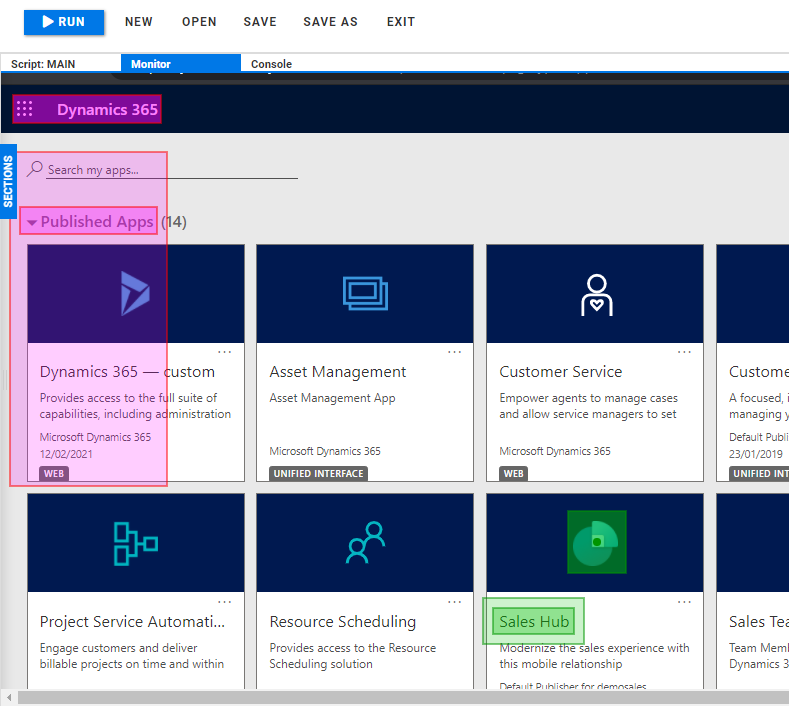
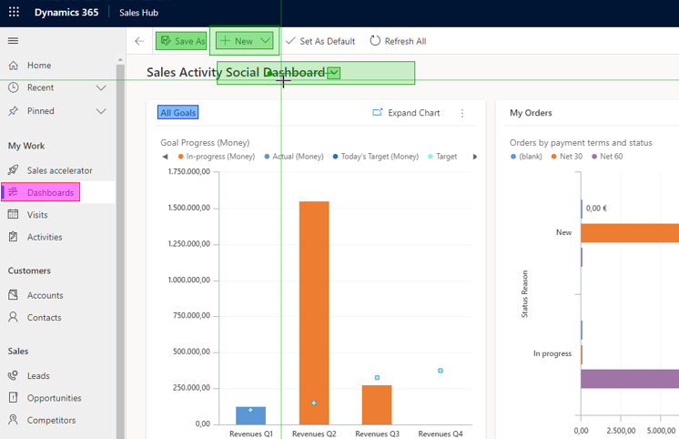
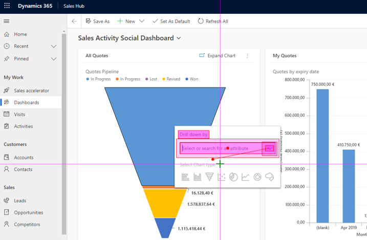
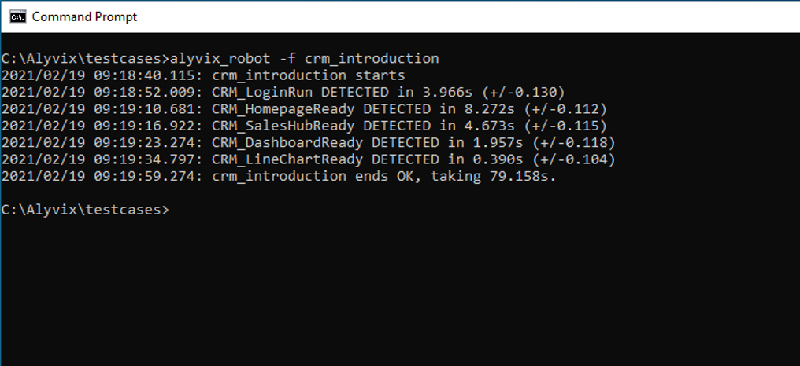

Can we use Alyvix to build a user-centric visual monitoring test case for Microsoft's Dynamics 365 CRM? Of course we can! Below we'll see how to create a runnable test case for the Sales Hub module, how to use Alyvix Robot to run it repeatedly, and how to interpret the measurements it produces.

===

## Introduction

Alyvix is a great tool for visual monitoring, regardless of the application whose availability and performance you're trying to keep tabs on. It uses the application's existing graphical interface just as users would, in order to check that it's working properly from the user's point of view.

Below we'll show you how you can use Alyvix to monitor the Sales Hub module within [Microsoft Dynamics 365 - CRM](https://dynamics.microsoft.com/en-us/crm/crm-system/). Besides showing you how to create a single test case to test one path through Sales Hub, we'll also set up that test case to be used repeatedly by Alyvix Robot as a practical monitoring example.

Our end goal is to find availability problems or slowdowns before users do, so we'll want Robot to run this test case over and over again, say every 3 minutes. This leads to some specific design choices, and we'll look at some best practices to help us choose. Finally, we'll see how Robot reports measurements once it's completed its run.

### Logging In

We start by launching Alyvix Editor. Since visual monitoring is user-centric, we want to think from the point of a user, so we follow every step a user would typically make. Thus we start by launching a browser and logging on, which is the standard use case for cloud-based Microsoft CRM applications.

To build our test case we need to show Alyvix how to find the Sign-in panel, and where the user name field and "Next" button are on that panel. Once we've marked those on a screen capture, we assign mouse actions and keyboard strings to those interface elements, mirroring how a user would insert their user name in the appropriate text field.

At the same time, we can also tell Alyvix to start up a browser by giving it the browser's executable path and some startup parameters like full-screen and private modes (private mode prevents the browser from keeping state like cookies from prior sessions, which can affect how the browser screens are rendered). Alyvix will automatically launch the browser before interacting with the CRM interface.

Next we need a similar step, but for the password request panel instead. We have to tell Alyvix where to find the password text field, that it nees to click inside it, and then to type in the password.

In this security-comprised world we of course need to encrypt our credentials to prevent them from being stolen by anyone who can view or copy the .alyvix file. Alyvix was built to easily handle encrypted user names and passwords by providing command-line [encryption and decryption tools](https://www.alyvix.com/blog/20200505_rdc_login). You can find out more on this subject by looking at [our videos](https://www.youtube.com/watch?v=sAmV1GVX-Y4) specifically about the subject of credentials encryption.

After receiving the user name and password, Microsoft's Dynamics 365 will ask us if we want to stay signed in. We don't, because then we couldn't measure how long it takes to sign in each time, which is one of the user-centric metrics we're interested in.

While we do want to measure the first login step, as it will also measure the web page load time, we don't need to measure the other two. So we can "turn off" measuring by unsetting the *Measure* flag for those two steps. It's also to our advantage to only measure the steps that are likely to be slow, as having too many measurements will make it harder to weed out the irrelevant ones.

### Navigating to the Task

After logging in, we arrive at the main application screen, which consists of rows of tiles, one for each module. Since we want to test the Sales Hub module, we need to find which tile represents it. First we check to make sure we're actually at the right screen, then we look for the Sales Hub logo along with the title below it to find the right tile.

We just have to tell Alyvix to click on the tile by clicking on its logo, then we give the step a name, and set an appropriate timeout. In this step we had to increase the timeout from the default 10 seconds to 20, because a bit of experimentation showed it sometimes takes more than 10 seconds to fully load the new page.

The Sales Hub module also takes a while to load completely, so we need to tell Alyvix which onscreen elements indicate that the page load has finished. It's not enough to mark the very first visual elements that typically appear, since those are usually static page elements. Instead we really need to point out the last ones to appear, as they are likely to be dynamically loaded. Otherwise, we would get a misleading picture because an application isn't usable when only small parts of its interface are visible.

### the Dropdown Menu Task

Now that we've logged in and loaded the Sales Hub module, we can finally start performing typical user tasks. Let's begin by opening up the Dashboards page. Here we'll need to make selections with two colors: purple and green. Since the menu items can be expanded and collapsed, and these properties can persist across multiple sessions, the menu items may not always be the same distance apart.

Alyvix uses the concept of groups of components marked by color, where selections with the same color must be a fixed distance away from others in that same color group. But that's not true for selections in other groups. So by using two different groups here, we can account for that variation in distance between menu items.

You can see we're starting to have a lot of steps in our script now, so it's important to avoid confusion by giving each step a meaningful name, allowing you to tell what it does at a glance. The scripting panel tells Alyvix Robot which order to run the steps in.

Besides interacting with buttons and text fields, Alyvix can also operate with any other user interface element. Suppose we want to open a dropdown menu like this one and select an item. We search for the "chevron" symbol (the downward-pointing arrow) which will always be to its right, but how far to the right depends on how long the item's name is.

So we use the "Set Point" action to click on the name rather than on the chevron itself, since by default a click will always occur in the center of a selection.

The click will open the dropdown menu, but since the menu wasn't visible when we captured this screen, we'll have to add another step where it will be visible.

When we switch back from the screen capture to Alyvix Editor, the dropdown menu disappears, so we definitely want to have a few extra seconds here to set that up by hand before Alyvix captures the screen. With some practice, 2 seconds will be enough, but feel free to set the *Add* delay at the bottom right to 5 seconds when you first try it.

Since Alyvix includes text recognition, we can choose an item in the menu based on the words it contains. We mark the region of interest (the area we expect it to appear in), change the selection's type to Text, and give it a regular expression. Alyvix will then click in the center of whatever text it matches. Using text recognition here will increase reliability when matching and reusability, with the tradeoff of taking a bit more processing time.

The next step will be to check something farther down on this same web page, so we can save a step if we can scroll down to it in the current step. Alyvix has a scroll action which applies a scroll movement just as if you were turning the wheel on your mouse. Changing it to 6 turns will move a large blue graphic into the visible part of the web page, setting up our next set of interactions.

### The Filtering Task

Now we can check another common CRM interface element: the filter. Our scroll action from the last step has moved a big graphic into the middle of the screen. If we click on it, a filter widget will appear.

We won't be able to see it until after we run this step, but it's easy to perform the click: just select a nearby fixed object and set its click point to be in the middle of the graphic. Steps likes this that just navigate through an interface without requiring a page load don't usually need to be measured.

The filter in this example updates immediately, but if it's likely to need to make a full database query, then it should probably be measured.

Now let's put a query string into our filter; we'll use "Quote" which we know ahead of time is populated with data. To put the focus on the text field, we just need Alyvix to click on it. Because Alyvix will always perform a mouse action before a keyboard action, we don't have to worry about typing a string into the wrong interface component.

In fact, Alyvix will first make sure all of the components in the component tree match the interface, and if it does so within the timeout, it will then sequence all of the actions of the components in the order they appear in the component tree. This is quite helpful here because it's not enough to just type in the filter string -- we also have to select a fixed value from the dropdown list it shows us.

Next, let's present the filtered data as a chart, which we can do by clicking on one of the icons below the filter field, say the Line chart option, which will filter the data and present the subset as a line chart. The CRM application in this case doesn't require much time to filter, so we won't measure it, but in a system with significant amounts of data it may become necessary to do so.

This brings us to our final interface check. To be sure that everything on the web page has loaded properly, we look for icons and labels in their correct positions. If we can run a series of checks that makes it this far down into a system task, we can be reasonably sure that most of the system is functional. And by measuring how long it took, we'll also know how the system is, and we can compare it to past performance.

### Cleaning up after Ourselves

Of course, running our test case a single time in Alyvix Robot will only tell us it's working at one particular point in time. And at the end of our test case, we'll have to log off and close the browser. Why?

Well, if you're going to run Alyvix Robot regularly and repeatedly using the same test case, then the state of the application at the end of that test case must match the state when it started.

I mentioned earlier that we should perform every step that a user would, including launching the browser and logging in. So we also need to shut everything down, which means logging out and closing the browser in the same way a user would.

It's important to remember that steps sometimes fail, either because the application is down or because it's so slow the timeout is exceeded. So what happens if our main script is interrupted before it finishes? Well, the logout won't take place, and the browser will stay open. If we don't resolve this problem, the next time we run the test case Robot won't be able to see the login screen, and it will fail before running any of the tests.

So we need some way to ensure that these last two steps will always run. We can do that by adding the Logout step to both the Main script and the Fail script, which runs whenever a step exceeds its Timeout value and its Break flag is set.

It's also possible that closing the browser won't completely kill it, so just in case we also kill the browser as part of the Exit script, which always runs after the Main script completes. This, together with the browser's private mode, ensures a completely clean environment each time we start running a test case.

To summarize, if everything goes right, the Main script executes, followed by the Exit script. If instead a timeout is exceeded on a step where the break flag is set, then the Main script stops running, the Fail script begins, and finally the Exit script runs.

## Measurement Output

When the Alyvix Robot is launched from the command line and its run concludes, it will display timing and precision data for all test case steps where the measurement flag was set, along with the total overall time.

The lines in the middle of the output correspond to the steps we asked Alyvix to measure by setting their *Measure* flags. You can find out more about the details of how steps are measured with our [Output Composition](https://www.youtube.com/watch?v=KS0oKjWCDUU) YouTube tutorial. Each line reports the time that step took as well as the precision interval for that measured time, and at the end of the run the total time for the test case is displayed.

Alyvix provides additional output formats that can be used to send this data to monitoring applications. You can find the details on [supported formats](https://www.alyvix.com/learn/test_case_execution.html#what-alyvix-robot-returns) in the online Alyvix user guide.

### Conclusion

If you're trying to find availability problems or slowdowns in your Microsoft CRM applications before your users do, you'll want to try Alyvix's visual approach to monitoring. It uses CRM applications' existing graphical interfaces just as users do, in order to check that it's working properly from the user's point of view.

If you'd like to build the Sales Hub test case we've described above in Alyvix, you can follow our [YouTube tutorial](https://youtu.be/U_ZqNIvktk8) which shows the details of every step, as well as an example test case execution of the test case on a real demo server.

From simple cases like using Alyvix Robot to manually run a test case whenever you like, all the way to sophisticated integrations with large scale monitoring systems, Alyvix is the right visual monitoring tool for the job.

<iframe width="288" height="162" src="https://www.youtube.com/embed/U_ZqNIvktk8?color=white&rel=0" frameborder="0" allow="accelerometer; autoplay; encrypted-media; gyroscope; picture-in-picture" allowfullscreen></iframe>
