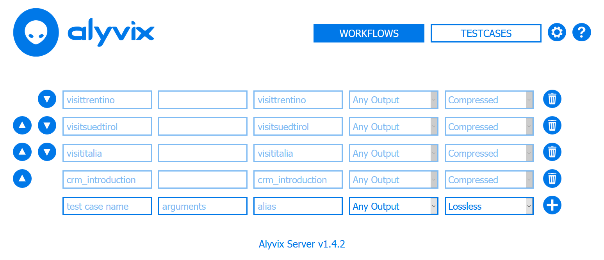
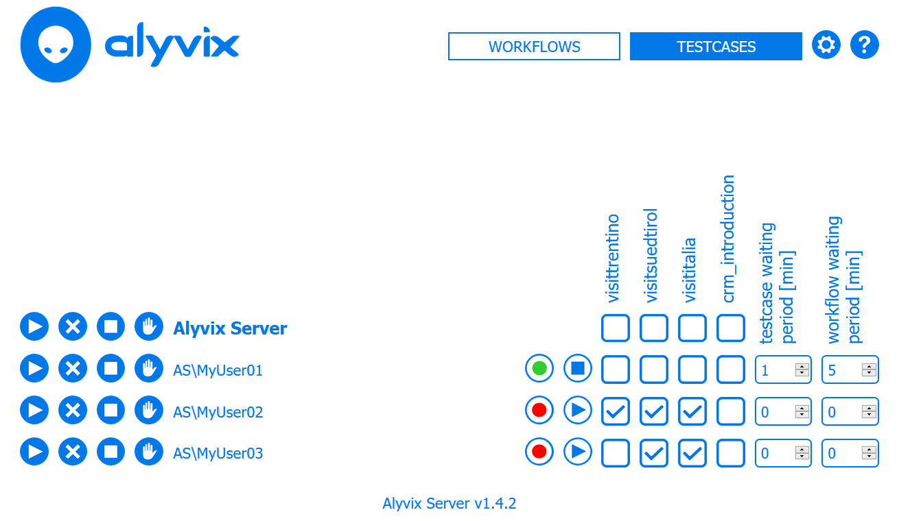
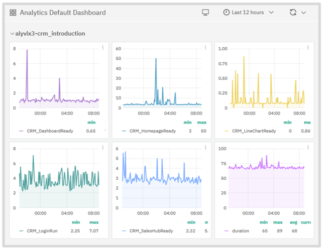
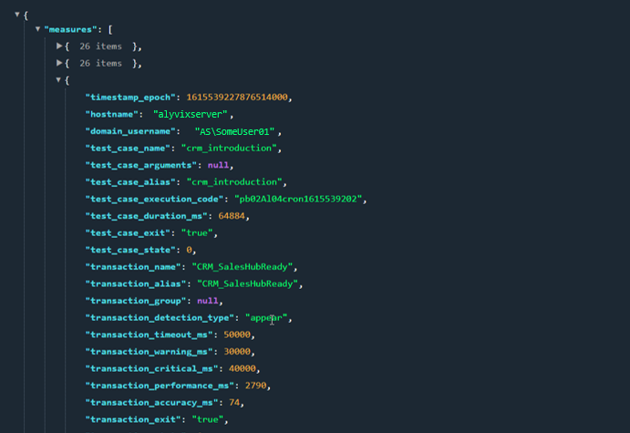
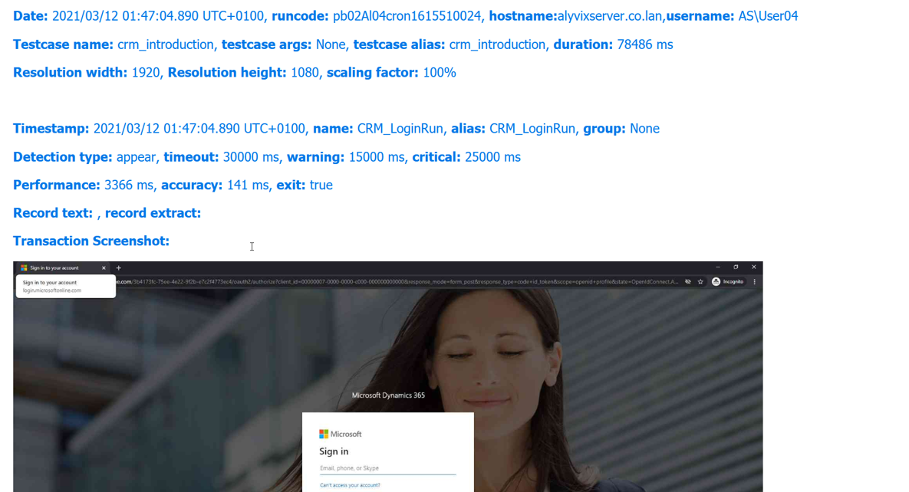

How can Alyvix Server help you day to day? Alyvix Server helps you manage multiple Alyvix robots across your RDP sessions, schedules and launches your test cases, provides a RESTful API for collecting measurement data, and delivers human-readable reports that certify your application's performance. This article showcases each of these capabilities as we configure an existing Alyvix CRM test case for Microsoft's Dynamics 365 CRM, integrate the measurement data into a monitoring system, and explore the resulting time series visualizations, which can provide you with both diagnostics and decision support.


===


## Introduction

Suppose you've just finished [creating a test case](https://www.alyvix.com/blog/20210226_dynamics_crm) that will test your [Microsoft Dynamics 365 - CRM](https://dynamics.microsoft.com/en-us/crm/crm-system/) installation. You'd like to test it at regular intervals, and automatically, rather than by pressing a button yourself every few minutes, 24 hours a day.

And once it's up and running, wouldn't it be great if you could easily see the results as time-based graphs and variable resolution, so you could see trends, see the effects of any changes you make to your hardware or configurations, and drill down to find the causes of specific problems?

Then [Alyvix Server](https://www.youtube.com/watch?v=cqJcyb84G3E) is just what you're looking for. Together with Alyvix and your favorite monitoring program, you can create test cases to visually monitor your applications, schedule multiple sets of test cases, gather the resulting data, and then visualize it at your leisure, all to help you improve the user-centric performance of your applications and services. Since an Alyvix test case can also pass along warning and critical values, it can also be used to send notifications when things go badly.

So let's take a look at what you will need to do to set all this up.


### Alyvix Server Configuration

To see how Alyvix Server can help you, we'll use it to schedule an Alyvix test case we've already made for a Customer Relations Management application, specifically Microsoft's Dynamics 365 CRM cloud-based web application. We'll configure it to run every five minutes (what we won't do in this article is configure the monitoring program, as that depends on the specific one you're using).

Alyvix Server's workflow panel gives you fine-grained control and real-time status information separately for each session.


### Alyvix Server Configuration

To start, go to the **Settings** page, a URL endpoint with this format:

```
https://<alyvix-server-address>/settings
```


This is where global parameters affecting all sessions are defined. If this is your first test case, you'll need to configure your test case file directory, where you'll put all your **.alyvix** files. Once that's done, it can be used by any of the sessions you add to the list farther down.

So go ahead and add the domain, user and password of the RDP session you intend to run the CRM test case on, and make sure the screen resolution matches the one where you recorded the .alyvix file.

Now let's switch to the **Testcases** page where we tell Alyvix Server the test case name, and optionally pass each test case some arguments, such as a URL or an ID to search. That way we can reuse an existing test case just by adding a new row where we specify the arguments and give it a unique name. (By the way, you can find detailed descriptions of all the options here in the official [Alyvix Server documentation](https://alyvix.com/learn/server/session_management.html).)



Next we'll tell Alyvix Server to save all screenshots by leaving the "Any Output" option alone, but we'll change from "Lossless" to "Compressed" to save space. Finally, we press the "plus" button to add this test case to the list of test cases available for scheduling.

Now we're ready to have Alyvix Server schedule our new CRM test case for execution. So we switch to the **Workflows** tab, where we see that the session is stopped and has no test cases assigned to it. We assign our new CRM test case to the session **MyUser01** by clicking on the box in the correct row, then press its "Play" button on the far left side. When it begins to run, it's traffic light will change from green to red.



In the Workflows panel, a session's status light turns red when one of its test cases starts to run, and then turns green again when that test case completes. Once a session's waiting period is over, Alyvix Server will rerun its assigned test cases. This panel allows you to configure when, in which session, and in what order a session's test cases will run.


### Visualization after Monitoring Integration

The next step is to configure your monitoring system to accept performance data from Alyvix Server. Doing this for any particular monitoring system will depend on that system, so we can't give you the steps to do it here. However, the [Alyvix Documentation](https://alyvix.com/learn/test_case_execution.html) provides the necessary details on how to do this, whether you want to use Alyvix's native JSON format, the NAGIOS standard, or publish via NATS.

Once completed, the monitoring system will begin to store the measurements published by Alyvix Server, and give you tools to explore it visually. You only need to navigate to the host that the test cases are running on (e.g., alyvixserver.co.lan), and then the named service corresponding to the Alyvix Server data source.

In the visualization section of the monitoring system you should see a separate graph for each point in the test case you asked Alyvix to measure. The visualization software will typically allow you to see the data with time on the X-axis, and let you zoom in and out of certain time ranges. In this example, each measure from Alyvix has a unique graph. You'll be able to see how long the login step took, how long it took to load the CRM application tiles, and how long the entire test case ran.



Taken together, these graphs show which critical points in the CRM application are behaving correctly or not. They can help you see when spikes occur, to explore trends over time, like whether segments of the CRM application (or any other segments, or any other application) are taking longer each day to run than the week before, to support you in deciding whether you need to increase your hardware resources, to see the effects after changing your hardware, or even if you can free up current virtual resources to save money.

Other visualization software like Grafana can show all of the test case measures overlaid cumulatively on a single graph, allowing you to inspect and drill down with additional features, which can greatly improve legibility, especially when you have a large number of measures.


## The Measurement API

So how does Alyvix Server communicate all this data to a monitoring system? Alyvix Server uses an open API to [collect and distribute performance metrics](https://alyvix.com/learn/server/measurement_web_apis.html) as each test case runs, and provides reports with screen captures at critical points which can serve as proof of application stability. The default output is a JSON structure that is regularly published to an endpoint using Server's measurements API, available via a URL-based query.

This JSON structure contains an array of measurement points, one for each step marked as "Measure" in Alyvix. In fact, these are the same steps we saw listed in the monitoring system visualizations earlier.



Each measurement point contains a time stamp, information about the host and test case as a whole, the name of the individual step, the actual and threshold measurement values, and intermediate results from processing the step.

In particular, the step name and transaction performance field in milliseconds is used by the monitoring system to create the graph, while the warning and critical thresholds are typically used to generate notifications.


## Viewing Reports

Alyvix Server also [produces reports in HTML](https://alyvix.com/learn/server/transaction_reporting.html) that are available from the same endpoint. The report list shows at a glance which test cases succeeded and which failed.

Clicking on any line in the list will take you to the full report, which includes detailed information about the test case overall, and about each step tagged for measurement in the test case.



Reports are kept for the amount of time specified in the retention policy that can be configured on the Settings page.

If the option in the session configuration is selected, then the steps will include the screen grab taken either at the moment the step matched, or else when the timeout was exceeded. Failed test cases as well as failed steps are easy to find as they are highlighted in red.

If a timeout is exceeded in a step, the screen grab will show the visual state of the application screen at that moment.


### Conclusion

So that's the outline of how to configure Alyvix Server for running an Alyvix robot, what to expect when integrating with a monitoring system and visualizing the resulting data, and how to display reports with visual proof of each transaction, whether successful or not. Happy visual monitoring!

<iframe width="288" height="162" src="https://www.youtube.com/embed/cqJcyb84G3E?color=white&rel=0" frameborder="0" allow="accelerometer; autoplay; encrypted-media; gyroscope; picture-in-picture" allowfullscreen></iframe>
