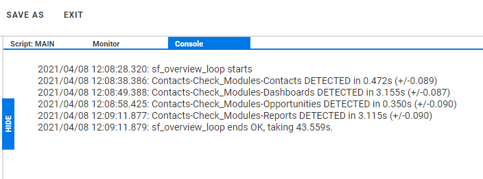
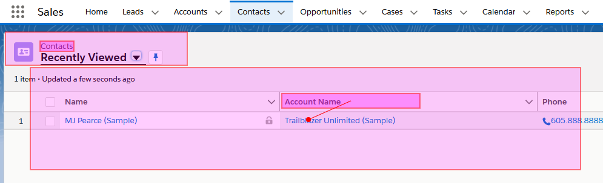
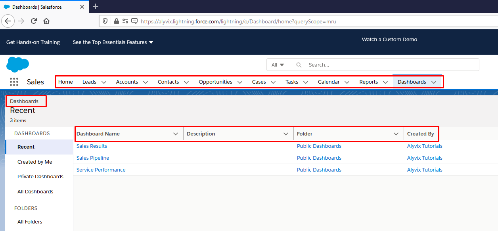
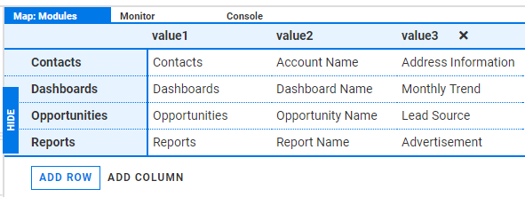
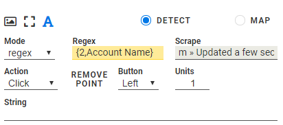
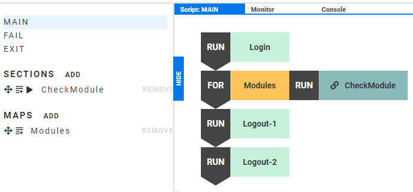

In this blog post we'll describe how you can create a panoramic Alyvix test case to visually monitor the Sales module of SalesForce Cloud Edition (Lightning). It checks mainly for functionality, availability and performance at a basic level over multiple tasks (e.g., Contacts, Dashboards, or Reports) rather than monitoring any single module in great depth.

===

## What This Tutorial Does

In this blog post we'll describe how you can create a panoramic Alyvix test case to visually monitor the Sales module of [SalesForce](https://www.salesforce.com/) [Cloud Edition](https://www.salesforce.com/products/sales-cloud/overview/) (Lightning). The idea behind a panoramic check is to quickly look at a large number of shallow tasks to ensure that the many elements within a large software suite are at least functional.

In a panoramic check we mainly look at availability and performance at just a basic level, by testing perhaps the result of a single click for each task. For instance in SalesForce Cloud Edition, we might run just one query each on areas like Contacts, Dashboards, and Reports rather than monitoring a single one of those areas with a detailed and lengthy series of interactions.

Because it has a large number of short interactions, a panoramic overview of a large software application can lead to a really long Alyvix script. Luckily for us, the SalesForce interface is very regular across all tasks with most actions based on text labels, so we can use Alyvix's loop feature based on a map of strings derived from the SalesForce interface.

Our approach will be to open tasks from the menu strip at the top. Once chosen, the appropriate panel for that task is swapped in at the bottom of the web application's screen. We'll initiate a single action, check that the results are as expected, and then move on to the next task.

Once we've created our test case and Alyvix Robot runs it, Robot will display the elapsed time for each measured step. For the test case we'll describe below, the final output will look like the following:

If everything goes well, our shallow SalesForce tasks will complete within a few seconds each, and we can then proceed to other, more detailed test cases for each task separately.

## Setting up the Test Case

So let's get started building our panoramic test case for SalesForce's Sales Cloud. We want to start by launching a browser and logging in. The easiest way is to use to a command prompt, launch the browser ourselves for now in private mode with the URL we want, and then also launch Alyvix Editor.

When the browser has loaded the login page for SalesForce Cloud Edition, we can begin to tell Alyvix Editor which fields in the login form we need to interact with. This includes the username and password fields, the "Remember me" box, and the login button.

We also need to show Alyvix how to start the browser in private mode at the login URL when the test case starts, which we can do by right-clicking on the root node of the first step and entering those parameters.

Next, we need to tell Alyvix what to do with each of the selections we just made in screen grab mode, such as which ones are buttons to click on, and which ones are text boxes that need a string like the user name inserted. The order is also important, otherwise if we clicked on the third button that says "Login", then the interface would already advance and a click on the fourth box called "Remember me?" would be ignored (or perhaps worse).

### Check a Single Task

OK, we've logged in, so now we're ready to start the first task. Let's start with a "Contacts" task, and following the concept of a panoramic check, we'll proceed to do a minimalistic interaction within that task.

### Contacts - Step #1

In our interaction we select a pair of anchor icons (the "Cloud" and "dots" icons at the top left) followed by the menu item "Contacts" from the horizontal menu strip near the top. The anchor icons ensure that Alyvix doesn't find a different word "Contacts" somewhere else on the page.

In this first step we only need to click on the menu item, so we choose the click Action for that interface selection. We'll name this step "Contacts-Start", add it to our list of steps, and then immediately test it out.

### Contacts - Step #2

We've now entered the Contacts task, so for the one interaction in our panoramic test case let's just click on the first account link listed in the table. Again we select some anchoring icons, and then the header of the "Account Name" column.

We want to click near the column name, but on the link right below it, not on the column header itself, which won't do anything. To offset the click from the center of the column header we use the "Set Point" option to indicate to Alyvix where exactly it can find the link to click on.

So once this second step finds the right column, it will click on the first account name directly below the header, which brings up the next page. Let's call this step "Contacts-Continue"

### Contacts - Step #3

The last step in our first task is to check the existence of certain labels or graphics both to ensure the page loaded correctly, and to allow us to find out how long the application needed to respond completely. To do this we need to include at least one visual element that will be one of the very last to appear in its correct position. Here we've chosen a text label near the bottom, selected in the second group.

As this is the final step for this task (it is minimalistic, after all!) we don't need to set up any further interactions, so we just give it a name like "Contacts-Check", add it to the script, and make sure that in fact it works.

## Hey Wait, These Tasks Are All Really Similar!

At this point we could proceed with creating three more steps for the second task in our panoramic test case, but we can see that many parts of the SalesForce interface are structurally identical. For instance each second step has the menu at the top, an identifying label on the left, and then a table with column headers and links to further pages.

It's the same with the Dashboards section, the Opportunities task, and also the Reports section. When we see this type of structural repetition, especially involving text, we can save time and make our test case more reusable by [using a loop](https://www.youtube.com/watch?v=gwaZjmSzOkw) in our script rather than just repeating out the same sequence of steps for each task.

So let's use the three Contacts steps we just created ("Contacts-Start", "Contacts-Continue", and "Contacts-Check") as the basis for our loop. What will we need to do to set up this loop?

We'll need something of substance to loop over, so we'll create a Map with text strings to look for in each interface. Once we have each text string, we use the special Map lookup notation in the "Regex" field to match it to the interface, where the number indicates the column in the Map from which to retrieve the value from, and the second argument is a default value.

We'll then have to make sure the Region of Interest covers an area where the strings for all of the tasks may appear in (not just the first "Contacts" strings). Finally, since we have three steps in each iteration, we'll have to create a Section for those steps, and insert a loop statement with that Section in the main script, since a loop can only iterate over a single entity.

### Implementing the Loop

So how do we actually do these four changes?

### Add a Map

Creating a Map of strings is quite easy. Go to "MAPS" at the left, click on "ADD", give it a name, and then start typing in values. In blue at the left is the row name, which is just a name for our use. Each row in the map represents a loop iteration, and each column marked "value" contains the text string that will be mapped to the number in the RegEx field for any Text Component encountered in that iteration.

After we finish our map definition, we can create a loop scripting element just by dragging the map into the main scripting panel.

### Set Text RegEx's

Now for each of the components in our original three steps, we change the component type to String and insert our loop notation with default value into the component's "Regex" field. Note that we don't have to duplicate or add any new steps, the Map takes care of all the new tasks. In fact, this approach is also more extensible because we can add more tasks at any time just by adding new rows of strings in our Map.

Now Alyvix will know what string to look for in what part of the interface. Well, actually at the moment it will look for it exactly where we told it to look for the strings in terms of the Contacts row. So we need to change that next.

### Resize the RoI's

Even though the SalesForce Cloud application layout is very regular, it's not perfectly regular. So the region of interest we initially set out in our Contacts task probably won't be big enough to contain the locations of the strings for the other tasks. We'll need to expand the single region of interest so that it will overlap all of them.

So as before we proceed through each component in each of our three steps to enlarge the region of interest to cover all potential locations.

### Set up the Loop

To finish setting up our loop, we create a Section that will serve as the loop object, add the three steps we want to loop over to our new Section, and remove them from the Main script. We then add the Map to the Main script to create the loop, and drag our new Section to set as object of the loop, so it will cycle over each of the steps in the Section's script.

While we're at it, let's generalize our step names as well. For instance "Contacts-Start" becomes "Task-Start", and "Contacts-Continue" becomes "Task-Continue".

## Wrapping Things Up

Finally we're ready to log out to conclude our test case so we can send the accumulated measurements to a monitoring system. SalesForce Cloud Edition employs a two-step logout sequence, where first you open an options/settings panel at the top right, and then click on the Log Out action.

We'll create two logout actions to implement this with the exciting names "Logout-1" and "Logout-2". Each is a simple step that only needs to locate the appropriate target to click on, and then actually click on it.

Once we're done, we'll add them to the Main script so that they run when our loop finishes. But we'll also add them to the Fail script so that if either the application or the connection slow down enough to exceed the timeout and break our test case, then Alyvix will still log us out anyway.

Otherwise, it would cause problems when we schedule our SalesForce test case to run over and over to show performance over time, since at the beginning of a new test case we would still be logged in after the last time we ran it, and it will fail because Alyvix won't find the expected interface elements (i.e., the login buttons).

Another part of exiting gracefully is that we should kill the browser, because our first step launched a browser process from scratch. This prevents multiple browser instances from running at the same time. To do this, we can just capture a screen without adding any components, and use the Root component to kill the browser process.

One final note: when we built our steps, we didn't change the defaults for the timeouts and the measure checkboxes. With loops it's easy to generate an excessive number of measurements, so be sure to uncheck the measurement checkbox on the steps where you don't really need them. Also, don't forget to adapt the timeouts according to your network characteristics.

### Conclusion

So that's how we can build an Alyvix test case to easily monitor the availability and responsiveness of SalesForce Cloud Edition's Sales module in a panoramic way. We started off with three steps for one task, and then since the SalesForce interface is so regularly structured, we easily adapted those steps to other tasks in the Sales module by creating a Map to loop over them as well.

By the way, if you're the kind of person who learns better visually, check out the [video version of this tutorial](https://www.youtube.com/watch?v=Ykw3oc3Swoo) on our YouTube channel.

<iframe width="288" height="162" src="https://www.youtube.com/embed/Ykw3oc3Swoo?color=white&rel=0" frameborder="0" allow="accelerometer; autoplay; encrypted-media; gyroscope; picture-in-picture" allowfullscreen></iframe>
