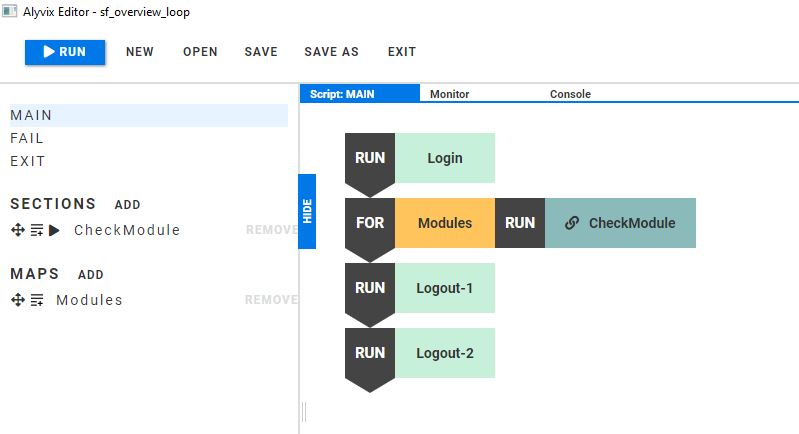
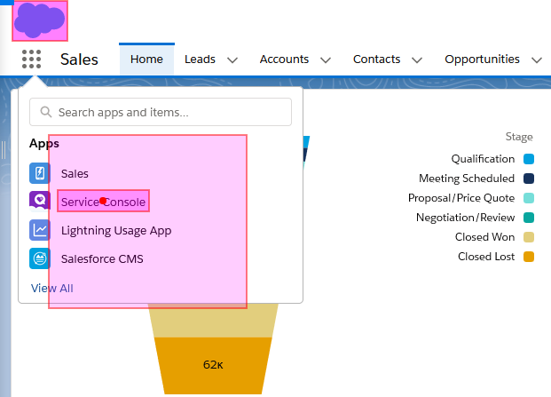
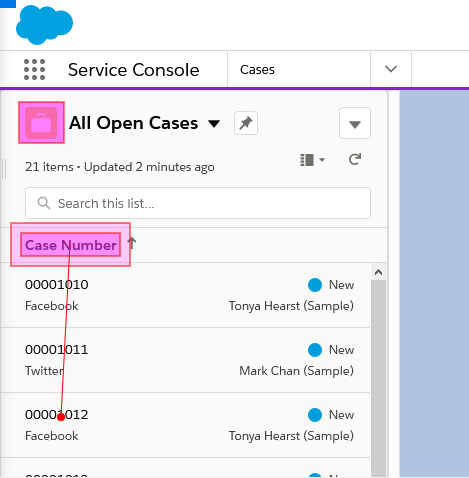
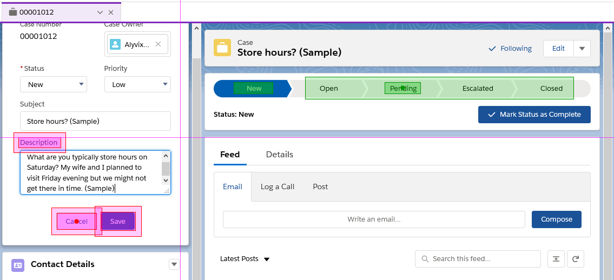
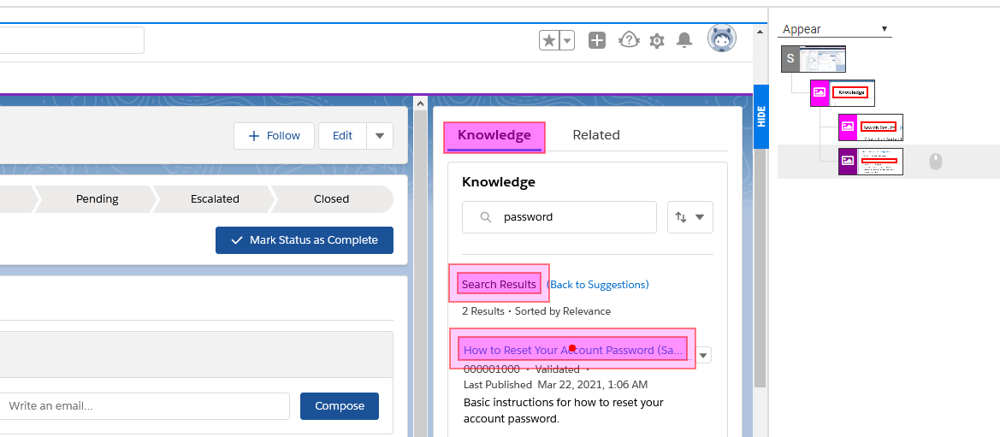

With larger software suites and web applications like SalesForce, you might tend to create two types of user-centric monitoring checks: shallow, panoramic test cases to make sure a large number of modules are working at a basic level, and then one or more deep, highly specific test cases to be sure a particular module is working across a range of its functionalities. This article shows you how to create a deep check, using SalesForce Cloud Edition as an example.

===

## Introduction

This tutorial will describe how to visually monitor SalesForce Cloud Edition's Service Console in depth. As opposed to a [panoramic test case](https://alyvix.com/blog/20210415_salesforce_cloud) which looks at a number of different modules in a shallow manner, a deep test case looks at a single module but in great detail.

In this article we'll construct a test case within the single Service Console module of SalesForce that can serve as a template for building additional wide-ranging checks on the availability and responsiveness across multiple features. The test case includes example interactions with a number of interface elements like menus, lists, buttons, search filters, and hover panels.

### Getting Started (Removing steps)

For a typical test case we would start building each of its steps from scratch. But since we just [published a video about building a panoramic SalesForce test case](https://www.youtube.com/watch?v=Ykw3oc3Swoo) last week, we already have a perfectly good test case that can serve as a shell with all the basics we need: logging in, logging out, and handling problems with the Fail and Exit scripts.

So instead of re-creating all of these steps, we'll copy our existing test case and remove what we don't need. To copy the previous test case, either load it in Alyvix and click on "Save As" with a different name, or use the copy command from the Command prompt. Within Alyvix Editor you can then remove the Map, the test case objects in the Section, the Section itself, and finally the loop in the Main script.

### Navigating to the Principle Task

Now that we have our test case shell, our first step will be to get from the landing page to the Service Console screen. To do this we indicate to Alyvix it needs to click on the app tray icon under the SalesForce Cloud icon.

Since we want to enter the Service Console module, we'll select its menu entry and expand the region of interest around where it might appear in case the list changes size, or the menu item appears in a different position.

We'll change it to a text component so that Alyvix looks for the right text string within that area. When Alyvix finds it during a run, it will click in the middle of that string, wherever it's located in our selected region.

Once we've clicked on the correct menu item, we'll arrive at the Service Console module, and we can finish the navigation phase of our test case for now and start constructing the main series of checks. 

### The Actual Monitoring Tasks

Now that we're within the Service Console, we're confronted with a dropdown menu, this time for choosing a specific service task. We'll choose a reference point near the dropdown (since the dropdown title can change), and then use Set Point to click on the dropdown itself so that it will open, and we can choose a specific action during the next step.

The first task we'll set up is to build a test case centered on the **All Open Cases** task, which lets support staff find, read and manage unresolved support requests. We'll look at commonly used features for that task such as searching, bringing up record details, and changing information on those records.

With the dropdown menu opened, we can now choose one of the actions. Just like we did two steps ago, we make a selection around the menu item we're looking for, and expand the region of interest around it so we can find it even if it doesn't appear at that exact position. We also again convert it to a text component, set the string as a regular expression, so that Alyvix will click in the middle of the selection when it finds it during runtime.

The next step in our task will be to choose one record to look at in more detail. We'll use two reference selections, and then again use Set Point to select one of the records, say the third one.

We'll use this third service record to check performance for the rest of this test case.

### The Record Detail Checks

At this point the record we requested is being displayed onscreen. We want to know how long it took to display fully, because requesting data is one of the most important tasks for human service agents in the course of their work, and the data is often retrieved from a backend database rather than locally. So measuring the time it takes for the details to appear (and later comparing it to other results) is a great way to see how long users will have to wait to get the data they need.

This step serves as both a check and as a continuation of the interactions needed for the test case overall. Here we've split these two elements into two groups. Group 1, the red group, checks that the record has been retrieved, as indicated by the selections under the description field. We leave the measure flag set on this step because we want to know how long it took to retrieve the record from the database.

The second group in green will test additional functionality, which changes a state of a record variable. In general, if you want to check that something works rather than find out how long it took, you wouldn't need to set the measure flag -- the fact that the test case fails is already the information you need.

### Search and Hover Check

Often a test case just needs to check that data retrieval is working properly; you don't really change the data itself. In other cases, you have to change data in order to make sure that the interface is working. Whenever you do this, you have to remember to reset the value to its original state, or else the next time the test case is run, Alyvix Robot won't be able to match the onscreen interface with the components for that step.

Once we've done that, we'll try out the search functionality using the second group. We enter a search term ("password"), immediately followed by the special **{enter}** [notation](https://alyvix.com/learn/test_case_building/designer_strings.html#special-characters), which activates the search engine. This action populates the search panel with our search term, while the *Enter* key launches the search itself.

From the search results, which appear underneath the search box, let's pick the first one in the resulting list. The Service Console of SalesForce includes a hover-based info panel, whose functionality we can check by moving the mouse over the title of the first item.

The Move action, as opposed to the Click action, won't select the item in the list, but when Alyvix moves the mouse to that point and then keeps it there, the system will interpret it as a hover action, and the hover panel will automatically appear, which will let us check that it popped up in our next step.

Next we want to check that that panel is ready. Our first two components locate the panel. However, it's possible that the panel structure is already part of the web page, and no measurable time is needed to display it.

It's also important to put content that you know is dynamically retrieved as one of the matched components, because if you only include static elements, you won't be measuring the time it takes to fill in the content of the panel, just the time it takes to show the outlines.

### Duplicating a previous step

Now that we've checked the "All Open Cases" task, let's go on to the next task, "Support Queue". We need to navigate to it, and this task is available from the same left-side menu as before. Since it's so similar, instead of creating these next two navigation steps from scratch, we can copy the work we've already done. Start by finding that original step, pressing the "Duplicate" button at the bottom, and regrabbing the screen if we need to adjust any selections.

We may not even need to regrab the screen. In the second step for instance, our new menu entry was already visible on the same dropdown menu. For a text component like this, we can oftentimes just change the regular expression.

### Final Check and Graceful Exit

Our final check will also include a bit of cleanup to restore the original state for the next time we run the test case. Of course we'll check that several structural elements are still there, that the dropdown menu item was successfully chosen, and that the tab header containing the ID number of our third line item is there.

At the same time we check for the tab we'll use its close action to also remove its record details panel. Note that if we forget to do this, the web application's built-in persistence means that the next time we open the "All Open Cases" task, this record details tab will still be opened there, and so when we run our test case it will fail due to the changed interface.

The main part of our in-depth test case is now over. We can keep the two logout steps from our previous test case in both the Main script and the Exit script, and kill the browser in the Fail script.

If any of the steps above aren't completely clear, you can watch our [YouTube video](https://www.youtube.com/embed/Ykw3oc3Swoo) that shows the steps in full detail.

## Conclusion

This test case showed how to monitor SalesForce's Service Console more deeply than the panoramic approach we used in our previous SalesForce test case. That test case used a loop and was more elegant than our very long script here, but we reused some of its steps to save time.

If Alyvix can successfully get through this lengthy test case, it's likely that every part of the Service Console is working. And since you'll probably want to create more than one deep-dive test case, save even more time by copying this Service Console test case and changing just what you need.

<iframe width="288" height="162" src="https://www.youtube.com/embed/Ykw3oc3Swoo?color=white&rel=0" frameborder="0" allow="accelerometer; autoplay; encrypted-media; gyroscope; picture-in-picture" allowfullscreen></iframe>
