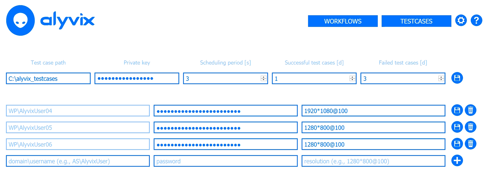
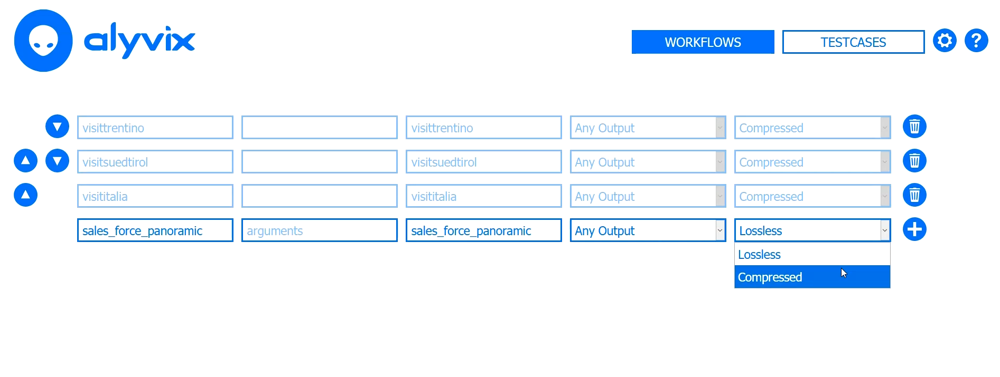
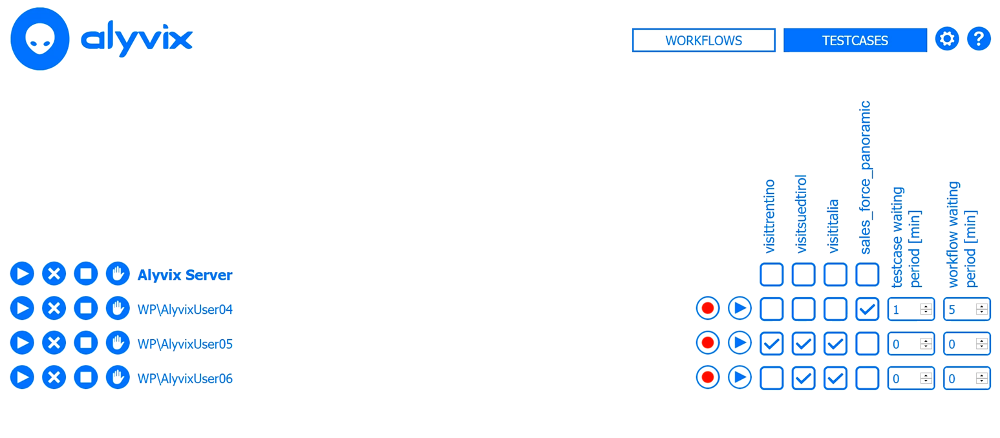
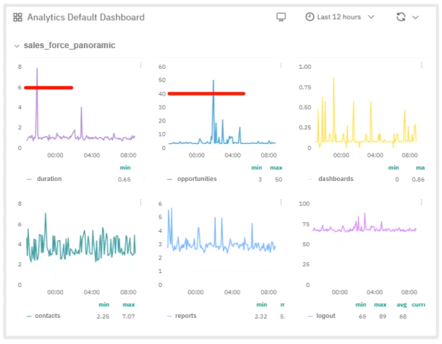
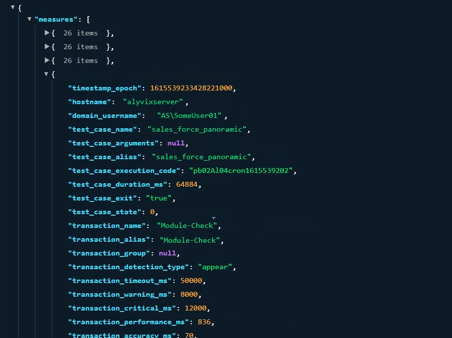
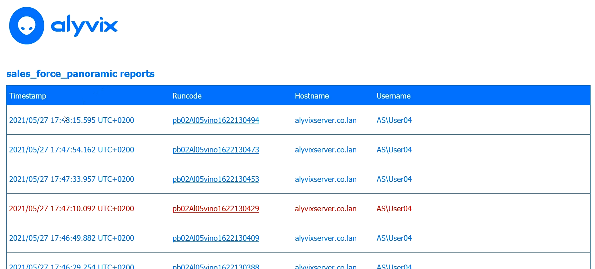
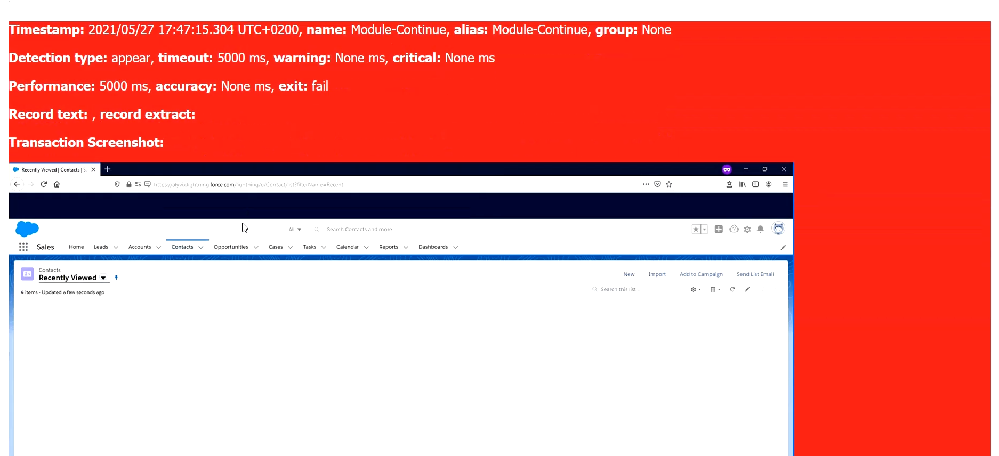

You use SalesForce Cloud Edition. Or maybe, you have a number of employees who use it. Then you'll want to make sure that they aren't losing time because of network problems or hardware bottlenecks. In this article I'll show you the basic steps you'll need to integrate Alyvix, Alyvix Server, and a monitoring system to both warn you in case of problems, and to visualize historical data for trend analysis or to save resources.

===

## Introduction

We recently detailed how you can [build a panoramic test case](https://alyvix.com/blog/20210415_salesforce_cloud) using Alyvix that will broadly check the availability and performance of your [SalesForce Cloud Edition](https://dynamics.microsoft.com/en-us/crm/crm-system/) application. Typically the more users you have, the more frequently you would want to run your new check.

So now you're ready with Alyvix Robot and a Command Prompt. But wait, what are you going to do now, run Robot every five minutes by hand? You need these checks to be scheduled automatically and run regularly, which means it's a job for automation.

Once your checks are working as desired, it's time to do something with all that data you collect. This can range from just identifying trends for future decision making, to direct problem solving by drilling down into the details, to using a monitoring system to send out warnings or notifications so that immediate human intervention occurs.

You can't carry out these tasks by looking directly at the raw numbers. You need a visualization system, especially one that's interactive across multiple dimensions like time. Modern monitoring systems include these capabilities, so the main obstacle is the automated scheduling of Alyvix Robot and then making the data available for monitoring.

The widely used web applications like SalesForce Cloud Edition must be highly responsive since they're remote, or else users won't be able to get their jobs done. But since they're completely out of your control, you can forget about getting the API-level access that is typically required to monitor their availability and performance.

[Alyvix Server](https://www.youtube.com/watch?v=cqJcyb84G3E) is the solution to the problem of monitoring user-centric network-based applications. Together with Alyvix and your favorite monitoring program, you can create test cases to visually monitor your applications, schedule multiple sets of test cases, gather the resulting data, and then visualize it at will. And since an Alyvix test case can also pass along warning and critical values, you can also use it to send notifications when things go wrong.

So let's take a look at what you will need to do to set all this up.


### Setting up Alyvix Server

So suppose we want to automatically schedule an Alyvix test case we've already made for a SalesForce task, specifically the panoramic test we mentioned above. We'll assume we have a lot of users, so we'll want to run it every five minutes (in this article we won't configure the monitoring program, but be on the lookout for several upcoming articles showing how to integrate Alyvix Server with several monitoring systems).

The companion [YouTube video](https://youtu.be/u61k7NYw_ss) will visually show you the steps you need to do.

To start, go to the **Settings** page, by entering a URL endpoint with this format (substituting your server name) into your browser's address bar:

```
https://<alyvix-server-address>/settings
```

The Settings page is where you can define the global parameters that affect all sessions. If you're new to Alyvix Server and this is your first test case, this page will be blank. You'll need to configure a test case file directory where you can put all of the files created in Alyvix and readable by Alyvix Robot, which have the **.alyvix** suffix. Once that's done, any sessions you add later can use any of the test case files in that directory.



Add the private key if you set a cipher for Alyvix Robot because you use credentials to log in during one or more Alyvix test case runs. Next, insert the domain, user name and password of the RDP session on which you'll run our SalesForce test case. Make sure the screen resolution you enter matches the one used when you recorded the **.alyvix** file.

Now let's go to the **Testcases** page where we add our test case name, and optionally pass each test case some arguments, such as a URL or an ID to search (assuming you've set up the test case to receive them). This lets us use an single test case more than once just by adding a new row where we specify the arguments and give it a unique name. (There are detailed descriptions of all the options in the official [Alyvix Server documentation](https://alyvix.com/learn/server/session_management.html).)



Next we'll tell Alyvix Server to save all screenshots by leaving the **Any Output** option alone. If desired, you can change the default option from "Lossless", which stores a pixel-perfect copy of the screen, to "Compressed", which can save a significant amount of space so you can use less storage or keep screenshots around for longer. Finally, pressing the "plus" button adds this test case to the list of test cases that we can schedule on a session.

We're now ready to show Alyvix Server how to schedule our new SalesForce test case for execution. Switch to the **Workflows** tab where you can see that the session is stopped (the white square on the blue background), and there are no test cases assigned to it. Let's choose the session **MyUser01** to run our SalesForce test case by clicking on the box in the correct row/column, then press its "Play" button on the far left side. The current status box will mirror this, and when it begins to run, its traffic light will change from green to red indicating whether that session is active at that moment.



When the assigned test cases have completed, and then the session's waiting period is over, Alyvix Server will start again to run its assigned test cases from the beginning. This panel allows you to configure when, in which session, and in what order a session's test cases will run.


### Setting up Visualizations

The next step is to [configure your monitoring system](https://alyvix.com/learn/server/monitoring_integrations.html) to accept performance data from Alyvix Server. Doing this for any particular monitoring system will depend on that particular system, so we can't give you the steps to do it here. However, the [Alyvix Documentation](https://alyvix.com/learn/test_case_execution.html) provides the necessary details on how to do this if your monitoring system is not yet listed at the link above. You can use Alyvix's native JSON format, the NAGIOS standard, or publish via NATS.

Once completed, the monitoring system will begin to store the measurements published by Alyvix Server, and give you tools to explore it visually. You only need to navigate to the host that the test cases are running on (e.g., in the accompanying [YouTube video](https://youtu.be/u61k7NYw_ss) we used *alyvixserver.co.lan*), and then the named service corresponding to the Alyvix Server data source.

In the visualization section of the monitoring system you should see a separate graph for each point in the test case you asked Alyvix to measure (i.e., by setting the *Measure* flag in Alyvix Editor). The visualization software will typically allow you to see the data with time on the X-axis, and let you zoom in and out of certain time ranges. You'll be able to see how long each measured step took, and an interactive graph of historical for each measured step, along with how long the entire test case ran (under the measure "duration").



Taken together, these graphs will show you which critical points in the SalesForce are responding in a timely fashion or not. They can help you see when spikes occur, to explore trends over time, such as whether typical SalesForce usage steps are taking longer each day to run than the week before, to support you in deciding whether you need to increase your hardware resources, to see the effects after changing your hardware, or even if you can free up current (virtual) resources to save money.

Other more specialized visualization software like Grafana can show the test case measures overlaid cumulatively on a single graph, allowing you to inspect and drill down with multiple data points at the same time, which can greatly improve legibility, especially when you have a large number of measures.


### The Measurement API

To communicate data about the measured steps to a monitoring system, Alyvix Server uses an open API to [collect and distribute performance metrics](https://alyvix.com/learn/server/measurement_web_apis.html) as each test case runs, and provides reports with screen captures at critical points which can serve as proof of whether SalesForce was performing stably at a particular moment in time. The default output is a JSON structure that is regularly published to an endpoint using Server's measurements API, available via a URL-based query.



Each measurement point contains a time stamp, information about the host and test case as a whole, the name of the individual step, the actual and threshold measurement values, and intermediate results from processing the step.

In particular, the step name and transaction performance field in milliseconds is used by the monitoring system to create the graph, while the warning and critical thresholds are typically used to generate and notifications propagate warnings.


## Viewing Reports

Alyvix Server also [produces reports in HTML](https://alyvix.com/learn/server/transaction_reporting.html) that are available from the same endpoint. The report list indicates at a glance which test cases succeeded and which failed, with red indicating failed runs.



Clicking on any line in the list will take you to the full report, which includes detailed information about the test case overall, and about each step tagged for measurement in the test case. Again, red indicates which steps within a single run were not completed before the associated timeout period expired.



Reports are kept for the amount of time specified in the retention policy that can be configured on the Settings page.

If the option in the session configuration is selected, then the steps will include the screen grab taken either at the moment the step matched, or else when the timeout was exceeded. Failed test cases as well as failed steps are easy to find as they are highlighted in red.

If a timeout is exceeded in a step, the screen grab will show the visual state of the application screen at that moment.

<iframe width="288" height="162" src="https://www.youtube.com/embed/u61k7NYw_ss?color=white&rel=0" frameborder="0" allow="accelerometer; autoplay; encrypted-media; gyroscope; picture-in-picture" allowfullscreen></iframe>
