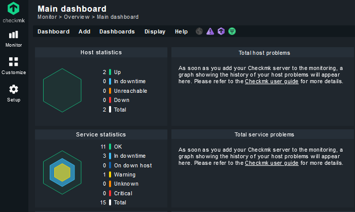
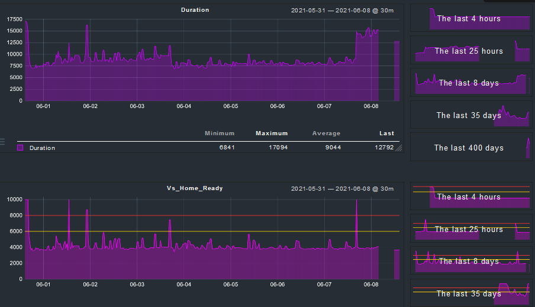
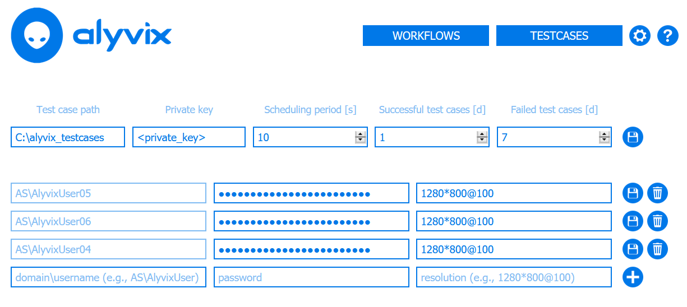
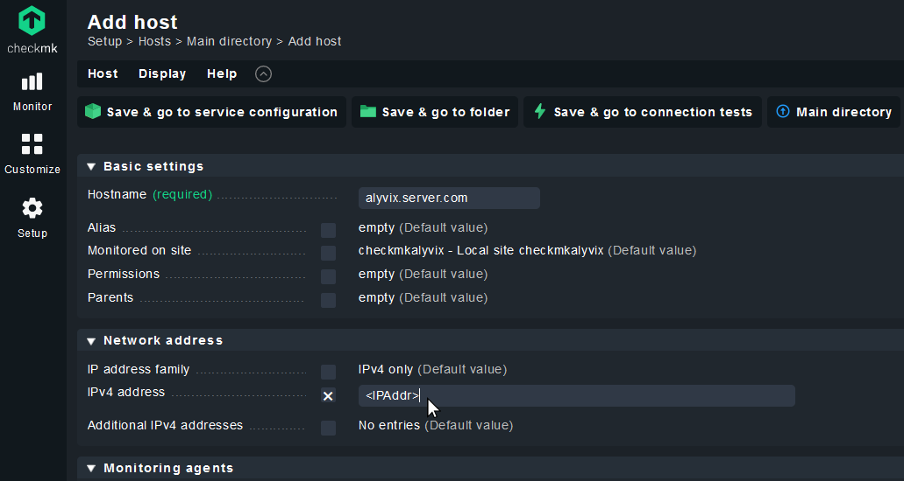
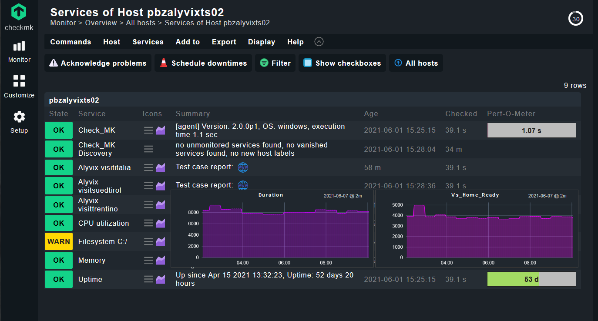

So you've made a few Alyvix test cases, and you want to take the next step to full scale monitoring.  Let's say you've also used Checkmk &#8482; as your monitoring system in the past, so you're familiar with it and you'd like to use it again.  Well you're in luck then!  This guide will show you how to set up both Alyvix Server and Checkmk to begin monitoring your Alyvix test cases and access Checkmk's dashboards and visualizations.


===


## Introduction

**Checkmk** &#8482; is a [full-featured monitoring system](https://checkmk.com/) that gives you a complete view of your IT infrastructure, quickly and effectively monitoring networks, servers, clouds, containers and applications.



It provides dashboards, visualizations, notifications, reporting and more, to help you ensure your systems remain in good health.  Alyvix Server easily integrates with Checkmk to deliver useful time-based graphs of Alyvix test cases that you can drill down on to see trends and investigate root causes of problems.



"Great!" you say, "Can we get started already"?"  Well, if you're already a monitoring pro, consider following our [simplified installation instructions](https://alyvix.com/learn/server/monitoring_integrations/checkmk_integration.html) in the [Alyvix Server documentation](https://alyvix.com/learn/server/index.html).  In this article I'm going to show you rather more specific details (and references to obtain even more detailed information), and here I'll assume you're starting from scratch.

Let's begin with a quick outline of the steps we'll be running through:
* Install the Checkmk 2 monitoring software
* Set up Alyvix Server on a Windows machine
* Start your test cases in Alyvix Server
* Configure Alyvix Server as a *host* in Checkmk
* Configure your test cases as *services* in Checkmk
* Check that your configuration was successful

Are you ready?  Great, let's take it step by step.


## Installing Checkmk 2

Checkmk 2 runs on Linux, either locally or virtually, so it can also be run on any platform that can host Linux, such as [WSL](https://docs.microsoft.com/en-us/windows/wsl/about) or [Docker](https://www.docker.com/) for Windows, as well as dedicated virtual servers like [VMware](https://www.vmware.com/).

When preparing to [install Checkmk](https://docs.checkmk.com/latest/en/intro_setup.html), you'll need to choose [a specific edition](https://checkmk.com/product/editions) and then [download the latest stable release](https://checkmk.com/download?edition=cfe&version=stable).  Checkmk's setup page includes links describing how to install the downloaded file regardless of your chosen platform.

Next, you'll need to create at least one *site*, which will circumscribe a particular monitoring environment (hosts, services, monitoring rules, etc.) You can then initialize the site and start running it by using the following commands:

```
$ omd create <site-name>
$ omd start
```

As part of the startup procedure, Checkmk will set up a web server that will serve as the interface you will use most for most functionality.  Type the server or virtual machine's IP address into the browser address bar as follows:

```
http://<ipaddr>/<site-name>
```

You'll be greeted with the login prompt (the [site documentation](https://docs.checkmk.com/latest/en/intro_setup.html#start_site) shows you how to either retrieve the automatically generated credentials or create new ones).  You're now ready to go on to the next step!


## Setting up Your Alyvix Server Machine

Use the [dedicated installation instructions](https://alyvix.com/learn/server/install.html) to install Alyvix Server.  In the next few steps we'll then configure it before beginning the integration itself.


### Set Basic Alyvix Server Parameters

You'll need to [configure basic settings](https://alyvix.com/learn/server/session_management.html#session-management-settings) such as the file path for your Alyvix test case(s), the scheduling and retention periods, and the credentials and resolutions for each session to run in parallel.




### Scheduling Test Cases in Alyvix Server

Now we need to add a test case on Alyvix Server so that test case results will be published by the Measurements API, and can thus be retrieved by the Checkmk agent when it runs later.  Copy your test case(s) into the path you configured above, and then [follow the existing Alyvix Server documentation to configure it](https://alyvix.com/learn/server/session_management.html#session-management-test-cases).

You can now use the Workflow page to [start the scheduling of your test case](https://alyvix.com/learn/server/test_case_scheduling.html#test-case-flow-assignment) by assigning it to a session and pressing the "Play" button.


The resulting measurement data and reports will then become retrievable via the Measurements API.


### Configuring and Testing the Integration

Also on your Alyvix Server machine you'll need to install the Python package which allows Checkmk to query the results of your test cases.  It requires the following two steps:

* Download and extract the package files from the [Alyvix Server integration repository](https://github.com/franzmelchiori/alyvix_server_checkmk) into the *$PYTHON3_DIR$\Lib\site-packages\alyvix_server_checkmk\* path of Alyvix Server's Python installation
* Additionally, copy the file named *agent_alyvix_server.bat* to Checkmk's special agent directory on your Alyvix Server machine at *C:\ProgramData\checkmk\agent\local\*

As an optional step, you can now manually test the local check in a command prompt to ensure it works:

```
C:\ProgramData\checkmk\agent\local\> agent_alyvix_server.bat

0 "Alyvix visitsuedtirol" duration=7246;;;;|vs_home_ready=3743;;;; ...
0 "Alyvix visititalia" duration=6985;;;;|vi_home_ready=3411;;;; ...
0 "Alyvix visittrentino" duration=8574;;;;|win_move=;;;;|vt_home_ready=1373;...
```

If the output is similar to that shown here, you're set for the next step.


## Configuring Alyvix Server as a Host in Checkmk

 Next, we need to set up Checkmk to recognize our Alyvix Server machine as a host, just like any other.  The [steps to follow](https://docs.checkmk.com/latest/en/intro_setup_monitor.html) are:

* [Create one or more "folders"](https://docs.checkmk.com/latest/en/intro_setup_monitor.html#folders) to store various types of hosts
* Place a Checkmk agent on the host machine (we already did this in the previous step)
* Add a host using [the appropriate form](https://docs.checkmk.com/latest/en/intro_setup_monitor.html#create_host) to enter the name and IP address
* Optionally you can configure standard services such as checking disk space or CPU, though it's not necessary for this example
* [Activate the changes](https://docs.checkmk.com/latest/en/intro_setup_monitor.html#activate_changes) to deploy them, so that Checkmk will begin to query the agents on the remote machines




## Configuring Test Cases as Services in Checkmk

We're now ready for the final configuration step:  linking Alyvix Server's Measurements API to Checkmk by telling Checkmk to look for any new service(s) on our host, and then schedule checks for them. Checkmk will then begin to retrieve and display the individual test case results.
We do this by [configuring services](https://docs.checkmk.com/latest/en/intro_setup_monitor.html#services) and then activating them.

In summary, you'll need to go to the Services View for our host in Checkmk and run the "Full service scan".  This action will find our new services and put them into the "Undecided services" list, where we can then look for all of the new Alyvix services (they begin with the string "Alyvix ") and pressing the green "plus" icon to tell Checkmk to start monitoring them.  Afterwards, we need to [activate the services](https://docs.checkmk.com/latest/en/intro_setup_monitor.html#activate_changes) (just as we did after configuring our host) by clicking on the "Pending changes" action at the top right.


## Checking Everything is Working

So we've configured everything, now it's time to check that it's all working.  If you go to the Host View for Alyvix Server, your Checkmk dashboard should look like the following, with a new Service entry for each Alyvix test case configured on Alyvix Server:



If you see a grey "PEND" state, feel free to click on "Reschedule 'Checkmk' service" to manually request an immediate update.

To visually verify that Checkmk is receiving the check results, you can (for each test case that's represented as a service):
* Hover over its graph icon to see a summary popup graph
* Click on the graph icon to go to its dedicated results page
* Click on the "blue globe" icon to see the latest report on Alyvix Server


## Conclusion

Congratulations on a successful integration with Alyvix Server and Checkmk.  You can now monitor your applications from a user's point of view, and use Checkmk to explore the resulting test case measurements as well as set warnings and send notifications, all in your favorite monitoring system!
