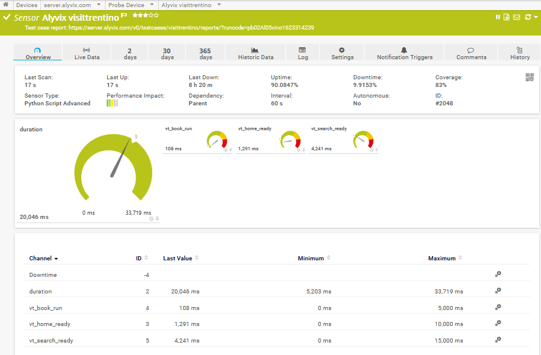
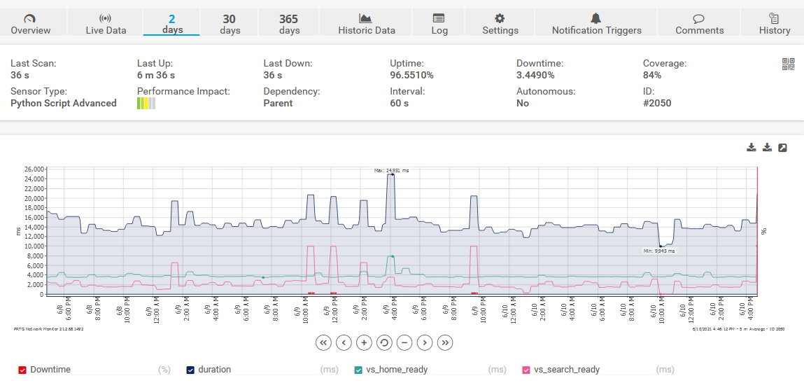
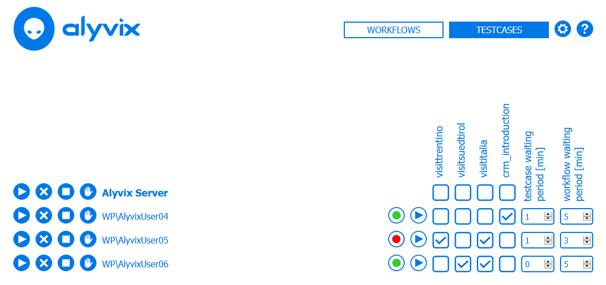
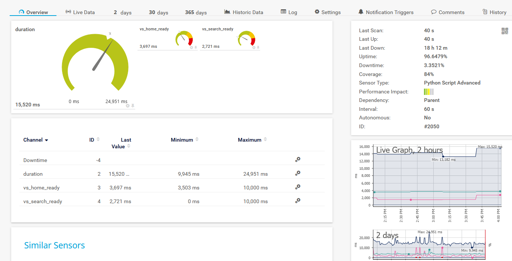

Because Alyvix uses a visual approach to monitoring, based on how a user experiences the functionality and latency of an application interface, it is highly complementary to more traditional monitoring systems that measure raw system numbers. It also easily integrates with monitoring systems like PRTG &#8482; that provide the ability to implement custom probes. Read on to see how you can integrate Alyvix Server with PRTG to add visual monitoring graphs to your existing PRTG dashboards and views.

===

## Introduction

**PRTG** &#8482; is a [widely utilized monitoring system](https://paessler.com/prtg/) that keeps an eye on all the systems, devices, traffic and applications found in your IT infrastructure. Based on Windows and suitable for businesses of all sizes, it's also powerful and easy to use.



PRTG provides dashboards, maps and other visualizations to help turn your raw monitoring data into concrete actions you can take to both solve problems that occur and prevent them from occurring in the future.

Alyvix Server easily integrates with PRTG to deliver useful time-based graphs of Alyvix test cases based on the visual monitoring paradigm, allowing you to drill down into the data to see trends and investigate root causes of the problems users perceive.



So how can you integrate Alyvix Server and PRTG? If you know your way around IT, you can just follow our [simplified installation instructions](https://alyvix.com/learn/server/monitoring_integrations/prtg_integration.html) in the [Alyvix Server documentation](https://alyvix.com/learn/server/index.html). In this article I'm going to show you the steps in more detail (along with references to obtain even more detailed information), and here I'll assume you're starting from scratch.

Let's begin with a quick outline of the steps we'll be running through:
* Install the PRTG 21 monitoring software
* Set up Alyvix Server on a Windows machine
* Start your test cases in Alyvix Server
* Configure Alyvix Server as a *host* in PRTG
* Configure your test cases as *services* in PRTG
* Check that your configuration was successful

Okay, let's get started!


## Install PRTG

Unless you're using the hosted (cloud) version, you'll first have to [download](https://www.paessler.com/manuals/prtg/download) the latest version of PRTG (version 21) and then [install the core server](https://www.paessler.com/manuals/prtg/install_a_prtg_core_server).

The local installer is a Zip file containing a Windows executable. If you select the *custom* installation mode, you can select the installation paths and start auto-discovery. When the installer completes, simply reboot your system. You can then [log in](https://www.paessler.com/manuals/prtg/login) and [enter your license key](https://www.paessler.com/manuals/prtg/enter_license_key).


## Set up Alyvix Server

Use the [dedicated installation instructions](https://alyvix.com/learn/server/install.html) to install Alyvix Server. In the next few steps we'll then configure it before beginning the integration itself.


### Set Basic Alyvix Server Parameters

You'll need to [configure basic settings](https://alyvix.com/learn/server/session_management.html#session-management-settings) such as the file path for your Alyvix test case(s), the scheduling and retention periods, and the credentials and resolutions for each session to run in parallel.


### Schedule Test Cases on Alyvix Server

Now we need to add a test case on Alyvix Server so that test case results will be published by the Measurements API, and can thus be retrieved by the PRTG probe when it runs later. Copy your test case(s) into the path you configured above, and then [follow the existing Alyvix Server documentation to configure it](https://alyvix.com/learn/server/session_management.html#session-management-test-cases).

You can now use the Workflow page to [start the scheduling of your test case](https://alyvix.com/learn/server/test_case_scheduling.html#test-case-flow-assignment) by assigning it to a session and pressing the "Play" button.



The resulting measurement data and reports will then become retrievable via the Measurements API.


### Configure and Test the Integration Script

Also on your Alyvix Server machine you'll need to install a Python script which allows PRTG to query the results of your test cases by downloading the Python local check script named *sensor_alyvix_server.py* from the [official repository](https://github.com/franzmelchiori/alyvix_server_prtg) into PRTG's custom sensor directory at *C:\Program Files (x86)\PRTG Network Monitor\Custom Sensors\python\* on Alyvix Server.

As an optional step, you can now manually test the local check in a command prompt to ensure it works:

```
C:\Program Files (x86)\PRTG Network Monitor\Custom Sensors\python\> sensor_alyvix_server.py -t visittrentino

{"prtg": {"text": "Test case report: https://alyvix.server.com/v0/testcases/...", ...}}
```

The output should be a JSON string similar to the above.


## Configuring Alyvix Server as a Host in PRTG

Next, we need to set up PRTG to recognize our Alyvix Server machine as a host, just like any other. To start, try to use the [auto-discovery](https://www.paessler.com/manuals/prtg/auto_discovery) feature. If that doesn't find your Alyvix Server, [add it manually as a device](https://www.paessler.com/manuals/prtg/add_a_device) by selecting its parent type and then inserting the device settings like IP address and credentials.

Make sure you click on the **OK** button, or else your settings will be lost.


## Configuring Test Cases as Services in PRTG

After PRTG includes your Alyvix Server machine as a device, you'll need to configure PRTG to recognize our test cases running on the Alyvix Server machine, known as [adding a sensor](https://www.paessler.com/manuals/prtg/add_a_sensor) in PRTG.

This is done by creating a [Python Script Advanced Sensor](https://www.paessler.com/manuals/prtg/python_script_advanced_sensor) on the PRTG core server linked to the Python script on Alyvix Server with these steps:

* From the host view for Alyvix Server, select the blue **Add Sensor** action. When asked for the sensor type, use the search bar with the string "python", and select the **Python Script Advanced** sensor type.
* In the configuration box that appears, leave most of the default settings, but make sure the **Python Script** field has the name of the local check script (*sensor_alyvix_server.py*) and the **Additional Parameters** field contains the name of your test case. Then click on the blue **Create** action when done.

You'll have to repeat these two steps to add a separate sensor for each Alyvix test case you plan to include in your services view.


## Checking Everything is Working

From the *Sensors View* of your Alyvix Server host in PRTG, you should now see results of the first few checks (remember that results won't be available until the test case has run at least one time):



If instead you see the service is still in a pending state (a gray box with a question mark), reload the page every so often until the results appear. Once the check results are visible, you can:

* Click on the graph icon to go to the dedicated, interactive results page (graph and sortable table)
* Copy and paste the URL (located at the top of the page) to see the most recent report for that test case on Alyvix Server


## Conclusion

So that's it, you've successfully integrated with Alyvix Server and PRTG. You can now monitor your applications from a user's point of view within your existing PRTG dashboards and views, and use PRTG to explore the resulting test case measurements as well as set warnings and send notifications, all in your favorite monitoring system!
