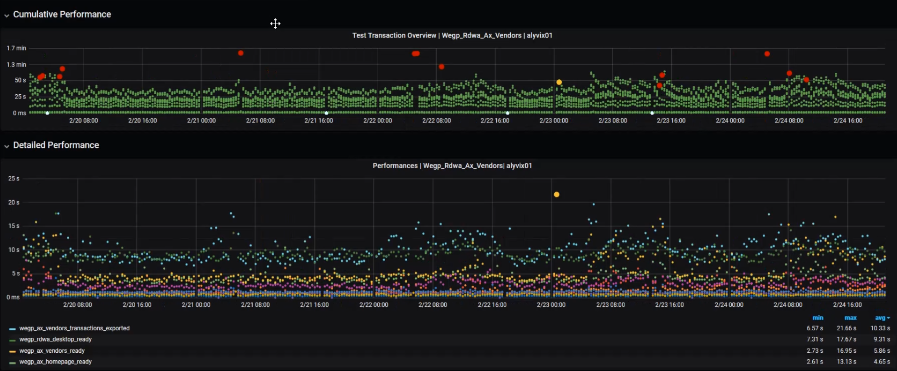
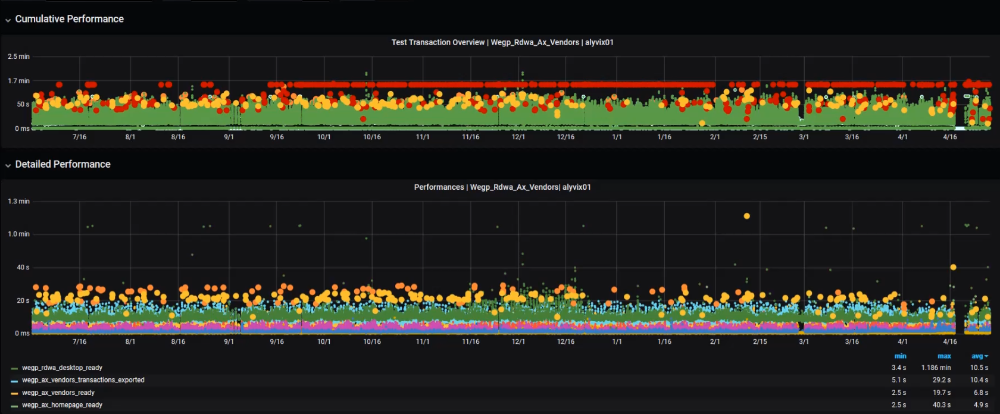
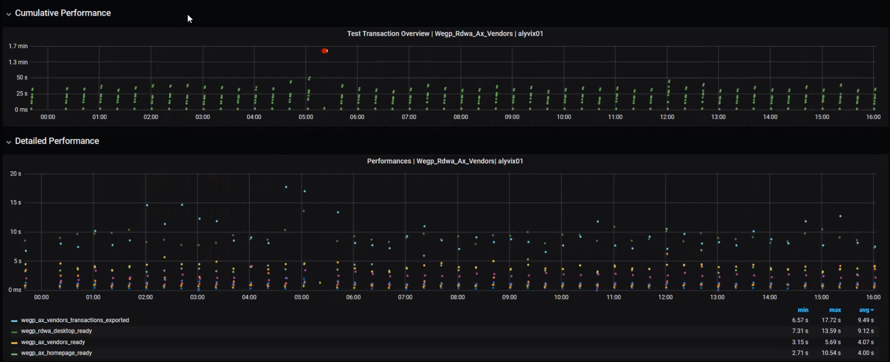
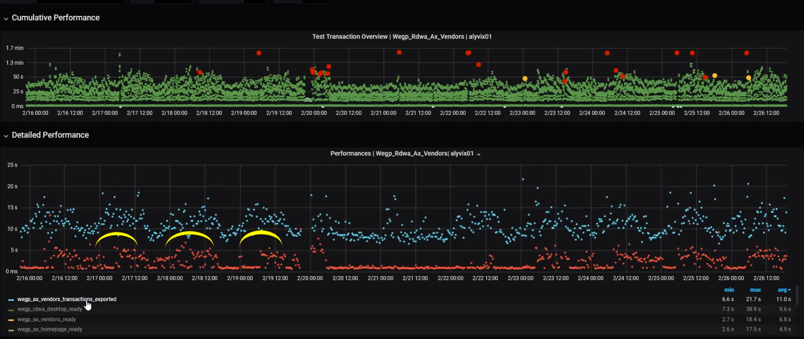
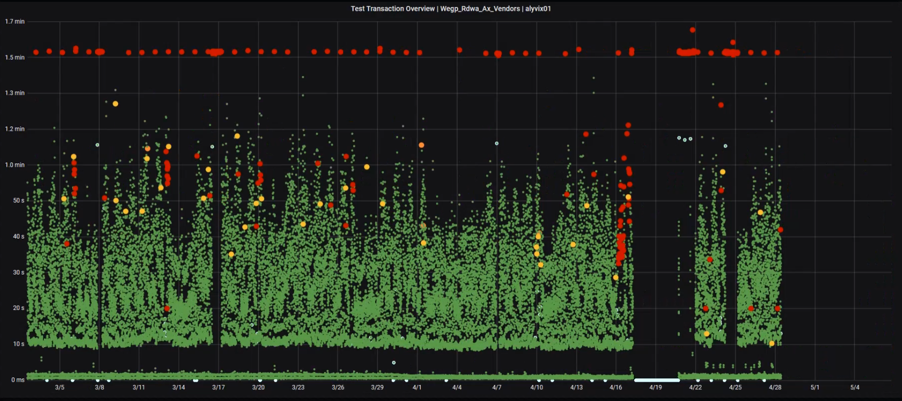

Monitoring is essential to keeping IT systems running smoothly. Alyvix Server's visual monitoring approach complements typical monitoring systems by directly measuring what users experience. You can explore these measurements graphically to find and certify severe latencies and service interruptions, potentially resolve them and even prevent them from occurring. That's the Alyvix Value.

===

## Introduction

Information technology is everywhere, even people who don't think of themselves as "computer people" depend extensively on steady, responsive systems and applications.

Think of ticket sellers who now sell online rather than in person or over the phone. Grocery distributors must move perishable foods from distribution centers to the stores that need them. Nurses need to log in to privacy-protected health IT systems to determine and record which patients get which pills.

They all need quick, smooth IT experiences to be productive and efficient.

IT systems have enabled huge productivity gains, but when they go down, all that productivity is lost and all activity is blocked until they're up and running again.

## Scenario

These three scenarios are rooted in the same type of problem: IT systems and applications that slow down so much they become unusable, leading to abandoned sessions, or that delay important actions with serious, real world consequences.

Traditional monitoring systems check objective measurements like storage capacity, CPU load, and network availability and throughput. But they don't measure applications the way users see them. Just because a server is working doesn't mean the applications running on it are working.

The goal of a visual monitoring system like Alyvix and Alyvix Server is to find out when applications aren't working as expected, *before* users notice anything wrong and *before* any important problems can occur.

For instance, if you have a service contract, Alyvix Server can certify when those services fall below guaranteed thresholds. If you're an administrator, Alyvix Server provides you early warning when problems *first* appear, giving you time to fix them before users see them.

## IT Operations Analytics

To find problems, it's helpful to visualize the data. Here we've displayed one year's worth of data in two interactive graphs. The overview graph on top combines latency and availability with one column representing an entire test case run every 15 minutes. The green, yellow and red dots show latency within, near and beyond a threshold limit.

The lower graph shows individual step completion times with a distinct color for each separate step. Using the Grafana visualization platform, we can drill down into the data by zooming in and out to any time period and scale. At the beginning we're zoomed out too far to be able to see any trends.

But as we zoom in to smaller time periods, we can begin to see more detail, like how long individual runs and steps took, and whether there were any full outages.

We can also see patterns in the data like how latency changes due to increased usage. For instance with a shopping application, we might see slower response times right before Christmas because many people are using it at the same time.

Once you arrive at a timescale where you can see individual steps, variations in particular test case runs appear, where the higher a dot is, the longer that step took to complete, and so users perceive the application as taking longer. 

In the upper graph, most of the points are green, because most of the time test cases and their steps succeed.

Zooming in can be helpful for resolving specific problems, but it's too detailed to see general trends. You might not be as interested that a particular nurse had trouble finding medical records on a particular morning, but rather how many mornings your entire nursing staff had to work slowly.

## ITOA for Problem Solving

Once we zoom out a bit, you can start to see patterns, especially when you select single steps or subsets of steps with the controls below the lower graph.

If you build your test case to reflect what a typical user does, then these two graphs combined will show you the minimum time it would take them to go through that task at the moment shown below the graph. In other words, how long it takes to buy a concert ticket. It also shows how long each component step takes, like logging in or waiting for an order confirmation.

Too much information can often hide trends, so let's look at just a few of the test case measures at a time. Let's try the "vendors_ready" measure first. Here you can see weekday latency peaks, and when the servers get to rest on the weekend.

If we look at the "transactions_ready" (red) and "transactions_exported" (blue) measures we see they have both similaraties and differences. They both have periods of elevated latency (points well above the average of each), while only the red measure has a large number of values lying along that measure's minimum.

Whenever you see these "latency clouds" where the latency goes well above the standard minimum time for a long period of time, then users will be experiencing much slower applications than normal, and you should check that this higher "new normal" (here lasting basically the entire work day) is not keeping your users from doing their jobs.

In the expanded Troubleshooting Overview graph, the height of each dot indicates the cumulative time spent waiting on the application, with green showing steps that finished within the expected time, yellow indicating a step exceeded its warning threshold, orange for a critical threshold, and red indicating a timeout, where the entire test case run is then abandoned.

Whenever we see a large cluster of timeouts as shown towards the right side, it's a sure sign that something needs to be fixed. In fact, after this "timeout cloud" you can see there was a significant amount of downtime (twice) in the following days.

Alyvix Server can help you see these problems that users are facing and do something about it, even if more typical monitoring measures don't yet show anything is wrong.

## Conclusion

Alyvix Server and its web-based Measurements API lets you use your favorite monitoring system and time-based graphing software to explore when your user-facing applications are suffering from latency bottlenecks, and thus becoming increasingly unusable.

By helping you analyze trends, providing decision support, showing certified proof of service levels, and triggering notifications and alerts, Alyvix Server can help you reduce costs while optimizing the user experience. And it's complementary to your existing hardware monitoring.

That's the Alyvix value.

<iframe width="288" height="162" src="https://www.youtube.com/embed/L_jEDSyKvGo?color=white&rel=0" frameborder="0" allow="accelerometer; autoplay; encrypted-media; gyroscope; picture-in-picture" allowfullscreen></iframe>
